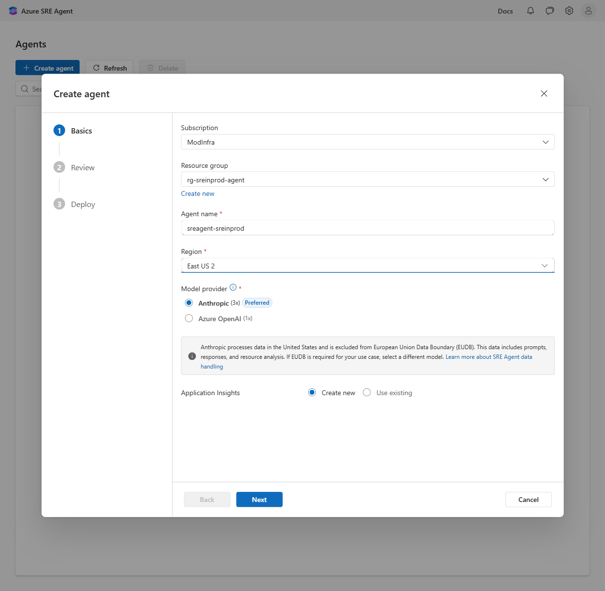
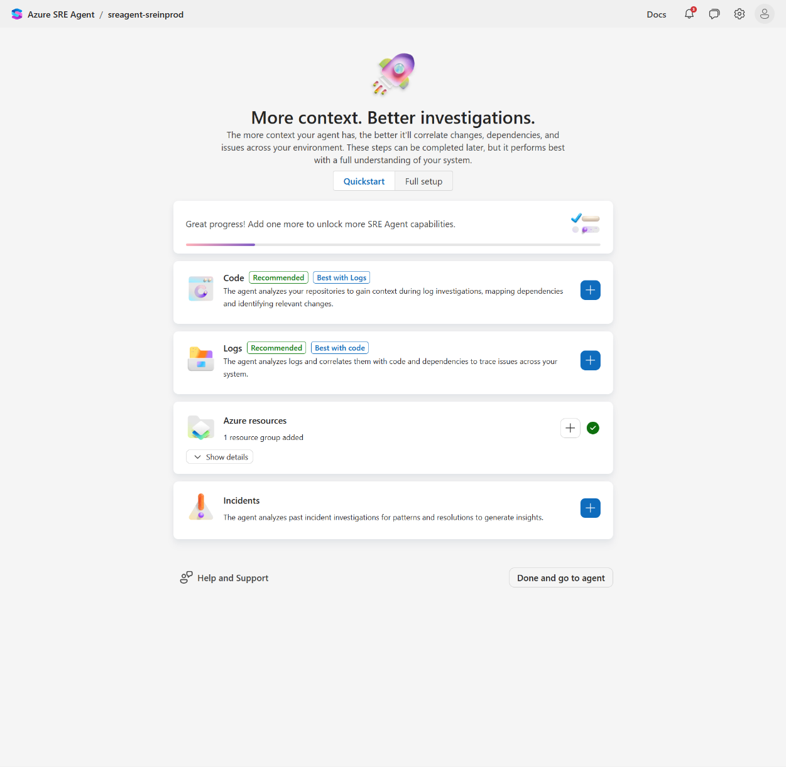
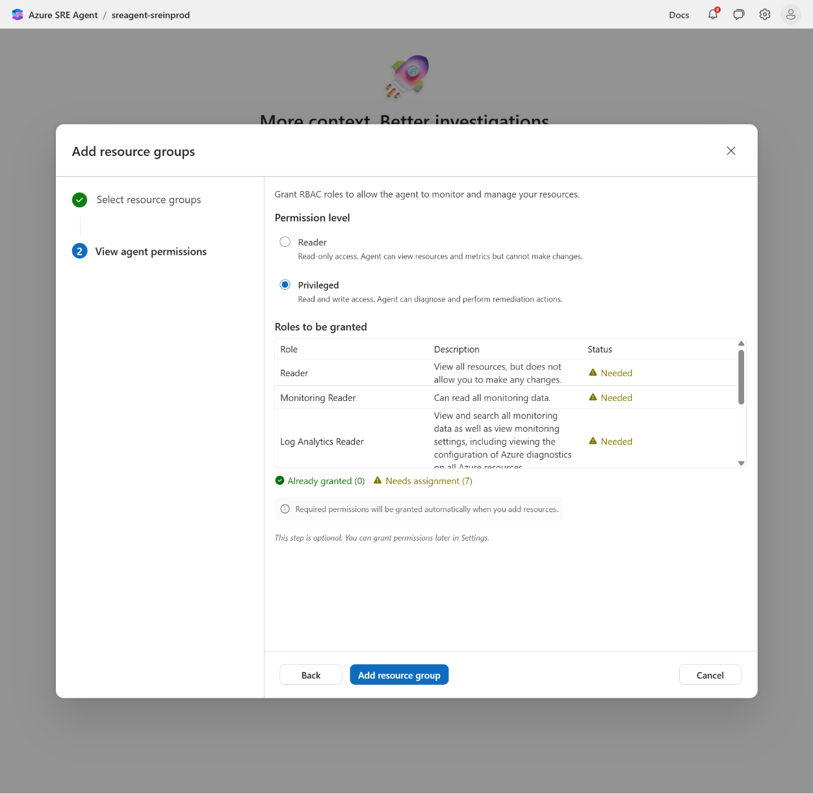

# Module 2 - Deploy the Agent

[← Module 1: Foundation](./1-Foundation.md) | [Workshop home](./ReadMe.md) | [Next: Module 3 →](./3-Connectors.md)

## Objective

Deploy a working Azure SRE Agent and attach it to the workshop demo workload.

## Prerequisites

The workshop environment must already be deployed (`scripts/deploy-demo-env.ps1` or `azd up`). After that, `scripts/env.conf` should contain:

```text
APP_RESOURCE_GROUP=rg-sreinprod-app
AGENT_RESOURCE_GROUP=rg-sreinprod-agent
APP_NAME=app-sreinprod-demo-<suffix>
APP_INSIGHTS_NAME=appi-sreinprod-demo-<suffix>
LOG_ANALYTICS_WORKSPACE=log-sreinprod-demo-<suffix>
```

## Before you start the wizard

Confirm three platform-level prerequisites. If any of these are missing the **Create** button in the portal will be disabled or the deployment will fail with `DeploymentNotFound`.

1. **Register the `Microsoft.App` resource provider** on the subscription that will host the agent. SRE Agent runs on the Azure Container Apps control plane, so the provider must be registered before the wizard can deploy backing resources.

    ```powershell
    az provider register --namespace "Microsoft.App"
    az provider show --namespace "Microsoft.App" --query "registrationState" -o tsv
    ```

    Wait until the state reads `Registered`.

2. **Verify your role**. You need `Owner` *or* `User Access Administrator` on the subscription. The wizard creates a system-assigned managed identity for the agent and then assigns RBAC roles on the monitored resource groups on your behalf. Only those two roles can grant role assignments.

3. **Allow outbound traffic to `*.azuresre.ai`**. The agent's hosted runtime calls back to that endpoint. If you're behind a corporate firewall, get it allow-listed before you continue, otherwise the chat UI will load but the agent will fail to respond.

## Lab steps

> The portal at `https://sre.azure.com` ships *two* flows you'll go through back-to-back:
>
> 1. A **3-pane Create-agent wizard** (`Basics`, `Review`, `Deploy`) that provisions the agent resource itself.
> 2. A **"Set up your agent" page** that opens immediately after deployment with four data-source cards (`Code`, `Logs`, `Azure resources`, `Incidents`). Each card opens its own mini-wizard.
>
> The workshop covers steps for both flows, then adds two cards (`Azure resources` is required for Module 6; `Code` makes the agent dramatically smarter at root-causing app errors).

### Step 1: Create the agent resource group

**What:** create an empty resource group that will hold *only* the agent and its automatically-provisioned dependencies (Managed Identity, Application Insights, Log Analytics workspace, the `Microsoft.App/SREAgents` resource itself).

**Why:** keeping the agent in its own RG (`rg-sreinprod-agent`) separates the *observer* from the *observed* (`rg-sreinprod-app`). You can delete or redeploy the demo workload without disturbing the agent, and the agent's own telemetry never gets mixed up with the workload's telemetry.

```powershell
az group create --name rg-sreinprod-agent --location eastus2
```

> The agent is only available in **Sweden Central**, **East US 2**, and **Australia East**. We use `eastus2` for the workshop. Pick a location that is closer to the region you used for the workshop Resource Group (`rg-sreinprod-app` by default) to keep latency and data-residency simple.

### Step 2: Open the SRE Agent portal and start the wizard

1. Browse to <https://aka.ms/sreagent> (it redirects to `https://sre.azure.com`).
2. Sign in with the same identity that owns the demo subscription.
3. The **Agents** list page loads. If this is your first agent you'll see the empty-state card *"Create your first Azure SRE Agent"* with a primary **`Create agent`** button. Click it. (Otherwise use the **`+ Create agent`** button on the top toolbar.)

**What:** this opens a 3-step dialog titled **Create agent** with header tabs **`1 Basics`**, **`2 Review`**, **`3 Deploy`**.

**Why portal (not CLI/Bicep) for the workshop:** the wizard is the easiest way to see exactly which roles and dependencies the agent needs, and it leaves a clean ARM deployment in `rg-sreinprod-agent`, *Deployments*, that you can inspect afterwards if you ever need to reproduce this with IaC.

### Step 3: Fill in the **Basics** pane

Use these exact values so later modules' screenshots and scripts line up.



| Field | Value | Why this value |
| --- | --- | --- |
| **Subscription** | Same subscription where you deployed Module 1 | The agent must live in the same tenant as the resources it monitors. |
| **Resource group** | `rg-sreinprod-agent` | Pick **Select an existing resource group**, then choose the RG you created in Step 1. |
| **Agent name** *(required)* | `sreagent-sreinprod` | Lowercase, hyphenated; must be unique within the RG. Used later in URLs and CLI commands. |
| **Region** *(required)* | `East US 2` | One of the three supported regions; matches the workload region. |
| **Model provider** *(required)* | **Anthropic (3x) Preferred** *(default)* | Powers the agent's reasoning. `(3x)` and `(1x)` are billing-rate multipliers (Anthropic costs 3x per token vs Azure OpenAI). We use the default because it's tuned by Microsoft for SRE workflows. **Anthropic processes data in the United States and is excluded from European Union Data Boundary (EUDB)**: if your workshop is run in a tenant that requires EUDB, switch to **Azure OpenAI (1x)** here. |
| **Application Insights** | **Create new** *(default)* | The agent uses its *own* App Insights for self-telemetry. This is **not** the App Insights that monitors your web app. Creating a fresh one keeps the two telemetry streams isolated. |

> ⚠️ **Model provider didn't appear at first.** The radio group only renders once a subscription is selected. If you don't see it, finish picking the Subscription and it will materialise.

Click **Next**.

### Step 4: Confirm the **Review** pane

The Review pane echoes back **only four fields**: Agent name, Region, Subscription, Resource group.

> 🔍 **Important:** the Review pane does **not** show your Model provider or Application Insights choice. If you're unsure, click **Back** and double-check the Basics pane *before* clicking Create. Those values cannot be changed after deployment.

Click **Create**.

### Step 5: Watch the **Deploy** pane

Deployment typically takes 2 to 4 minutes. While it runs, the dialog is modal (Close/Cancel are disabled) and the **Resource operations** list streams progress live. In a normal run you'll see seven operations succeed in this order:

| # | Resource | Type | What it is |
| --- | --- | --- | --- |
| 1 | `rg-sreinprod-agent-roleAssignments-…` | Nested deployment | Grants the agent's own managed identity the roles it needs on its sibling resources. |
| 2 | `sreagent-sreinprod-<suffix>` | **Managed Identity** | User-assigned identity that the agent runs as. |
| 3 | `workspace<suffix>` | **Log Analytics Workspace** | Stores the agent's *own* operational logs. |
| 4 | `sreagent-sreinprod-<suffix>-app-insights` | **Application Insights** | Captures the agent's *own* traces/metrics. |
| 5 | `sreagent-sreinprod` | **Azure SRE Agent** (`Microsoft.App/SREAgents`) | The agent resource itself. |
| 6 | `UserRoleAssignment-…` | Nested deployment | Grants **you** (the creator) administrative access on the new agent so you can chat with it. |
| 7 | *"Warming up your agent"* | **Agent Site** | Spins up the hosted chat backend at `*.azuresre.ai`. |

When the banner flips from *"Deployment in progress…"* to ✅ **"Deployment succeeded"**, the **`Set up your agent`** button activates.

Click **`Set up your agent`**.

### Step 6: Land on **"Set up your agent"** and inspect the four data-source cards

You're now on the agent's overview page (URL: `https://sre.azure.com/agents/subscriptions/<subId>/resourceGroups/rg-sreinprod-agent/providers/Microsoft.App/agents/sreagent-sreinprod`).



The banner says *"More context. Better investigations."* and lists four data sources:

| Card | Why we connect it |
| --- | --- |
| **Code** *(Recommended, "Best with Logs")* | Lets the agent map exception stack traces back to the lines of code that produced them. Required for the *"why is this app throwing 500s?"* path in Module 6. |
| **Logs** *(Recommended, "Best with code")* | Wires up external log providers (Datadog, Grafana, etc.). **The agent already queries your App Insights / Log Analytics through Azure RBAC** (Step 7), so this card is *only* needed if you also pipe telemetry to a non-Azure stack. Skip it for the workshop. |
| **Azure resources** | The new home of the old "Managed resources + Permissions" wizard panes. This is the **required** card for the workshop: it both attaches `rg-sreinprod-app` and assigns the RBAC roles. |
| **Incidents** | Connects ServiceNow / PagerDuty / Azure Monitor Alerts as an incident source. Out of scope for Module 2; Module 5 covers wiring alerts. |

We will connect **Azure resources** (required, Step 7) and **Code** (recommended, Step 8). You can leave the other two for now.

### Step 7: Connect **Azure resources** (required)

Click **`Add resources`** on the **Azure resources** card. The **Add Azure resources** dialog opens with its own two-step header (`1 Choose resource type`, `2 Choose subscriptions`).

**Sub-step 7a, Choose resource type.** Select **`Choose resource groups`** (least-privilege; the alternative `Choose subscriptions` would give the agent visibility into *every* RG in the sub). Click **Next**.

**Sub-step 7b, Select resource groups.** The dialog header changes to **`Add resource groups`** with steps `1 Select resource groups`, `2 View agent permissions`.

> ℹ️ The dialog shows a banner: *"Only resources where you have the Owner or User Access Administrator role are listed. These roles are required to grant the agent access."* If the RG you created when you started this workshop isn't visible, the missing permission is *yours*, not the agent's.

1. Narrow the **Subscription** filter to the one that holds the workshop RG.
2. Use the search box if needed and **tick the box** next to workshop you deployed as part of the workshop.
3. The counter should read **`1 selected`**. Click **Next**.

**Sub-step 7c, View agent permissions.** Select the Privileged permission for the agent. The role list on the page changes based on your choice:



| Permission level | Roles assigned on `rg-sreinprod-app` | Use it when… |
| --- | --- | --- |
| **Reader** *(default)* | `Reader`, `Monitoring Reader`, `Log Analytics Reader` (3 roles) | You want the agent to *propose* every action and have a human approve in chat. Safest. |
| **Privileged** ⭐ recommended for this workshop | All Reader roles, plus `Log Analytics Contributor`, `Application Insights Component Contributor`, `Website Contributor`, `Web Plan Contributor` (7 roles) | You want the agent to actually execute approved remediations end-to-end. Required for Module 6's *"flip `INJECT_ERROR` back to 0"* drill. |

**Why Privileged for the workshop:** `Website Contributor` and `Web Plan Contributor` give the agent the ability to change app settings, swap slots, and restart the app, which is exactly the surface area Module 6 will exercise. The roles are scoped to the **single RG**, so the agent still can't touch anything in `rg-sreinprod-agent` or in unrelated RGs.

**Why not narrow it further (e.g. only `Website Contributor` on the web app):** the portal's Privileged mode is RG-scoped and atomic. There's no in-UI knob to scope per resource. If your security review requires it, you can use **Reader** here and add a narrower role manually via `az role assignment create --scope <webAppId>` afterwards. For the workshop, RG-scope is fine.

The page shows the role table with status chips (**Already granted (0)** / **Needs assignment (7)**) and a confirmation strip: *"Required permissions will be granted automatically when you add resources."*

Click **`Add resource group`** to commit. Back on the *Set up your agent* page the **Azure resources** card now reads **"1 resource group added"** with `Add more` and `Show details` actions.

### Step 8: Connect **Code** (recommended)

Click **`Connect repositories`** on the **Code** card. The **Add repositories** dialog has three steps: `1 Choose a platform`, `2 Authenticate`, `3 Add repositories`.

**Sub-step 8a, Choose a platform.**

| Field | Value |
| --- | --- |
| **Platform** | **GitHub** (alternative: **Azure DevOps**) |
| **GitHub host\*** | `github.com` (use `<tenant>.ghe.com` for GitHub Enterprise Cloud; GitHub Enterprise *Server* is not supported) |

Click **Next**.

**Sub-step 8b, Authenticate.** Choose a sign-in method:

| Method | When to use it |
| --- | --- |
| **Your account** *(default)* | Easiest: OAuth grant flow, the agent reads repos as you. Pick this first. |
| **PAT** | Fallback if OAuth fails or your tenant blocks OAuth apps. Use a fine-grained PAT with **read-only contents** on the one repo. |
| **Bring your own GitHub App** | Production option for teams: survives the original creator leaving, and lets you scope per org. |

Click **`Sign in to GitHub`** and complete the OAuth grant **in the same browser window**. When the panel updates to show **Connected as `<your-handle>`** ✅, click **Next**.

> 🐞 **Known gotcha: "Invalid state / OAuth state rejected".** If the GitHub redirect comes back to a different browser session than the one that started it, you'll see `{"error":"Invalid state","message":"OAuth state rejected."}`. Cause: the OAuth popup opened (or was completed) in a *different* browser or profile than the SRE Agent tab, so the anti-CSRF state cookie can't be matched. Fix: cancel the dialog, click **`Connect repositories`** again, and ensure the GitHub sign-in completes **in the same browser session**. If it still fails (corporate browser policies, third-party-cookie blockers, etc.), switch to **PAT** on the same Authenticate step. It bypasses the OAuth handshake entirely.

**Sub-step 8c, Add repositories.** This is **not a list picker**; it's a manual URL grid. Fill out the first row to add our sample repo:

| Column | Value for this workshop |
| --- | --- |
| **Repository URL\*** | `https://github.com/Azure-Samples/app-service-dotnet-agent-tutorial` |
| **Display name\*** | `app-service-dotnet-agent-tutorial` |
| **Description** | `Sample .NET app` |

> Add another row for your IaC repo (e.g. your forked `SREinProd` repo) if you want the agent to also understand `infra/main.bicep`. Not required for Module 2.

Click **Save**. The **Code** card now reads **"1 repository"** ✅.

### Step 9: Smoke-test the agent

Click **`Done and go to agent`** in the *Set up your agent* page footer (or use the breadcrumb to open the agent's chat view). In the chat pane, ask:

```text
What App Services do you see in <your workshop RG>, and which alert rules are configured on them?
```

You should get back:

- the demo web app (`app-sreinprod-demo-<suffix>`),
- the `Http5xx` metric alert defined in `infra/main.bicep`.

**Why this prompt:** it exercises three of the agent's Azure-RBAC paths in one shot: ARM resource enumeration, App Service slot awareness, and Azure Monitor alert rules. If any of them comes back empty, the agent's RBAC didn't propagate. Recheck Step 7c before continuing to Module 4.

Then optionally ask:

```text
What does the Program.cs in app-service-dotnet-agent-tutorial do?
```

A correct answer (mentions the controllers, the `INJECT_ERROR` feature flag, etc.) confirms the GitHub indexing from Step 8 is live.

## Validation checklist

- [ ] `Microsoft.App` provider is `Registered` on the subscription.
- [ ] Agent resource (`sreagent-sreinprod`) exists in `rg-sreinprod-agent`, along with a sibling managed identity, Log Analytics workspace, and Application Insights instance.
- [ ] You can open the agent at `https://sre.azure.com`.
- [ ] On the *Set up your agent* page the **Azure resources** card reads **"1 resource group added"** (= `rg-sreinprod-app`).
- [ ] The agent's managed identity holds the **7 Privileged-mode roles** on `rg-sreinprod-app` (`Reader`, `Monitoring Reader`, `Log Analytics Reader`, `Log Analytics Contributor`, `Application Insights Component Contributor`, `Website Contributor`, `Web Plan Contributor`). Verify with:

    ```powershell
    $miId = az resource show `
      --resource-group rg-sreinprod-agent `
      --name sreagent-sreinprod `
      --resource-type "Microsoft.App/SREAgents" `
      --query "identity.principalId" -o tsv
    az role assignment list `
      --assignee $miId `
      --resource-group rg-sreinprod-app `
      --query "[].roleDefinitionName" -o tsv
    ```

- [ ] The **Code** card reads **"1 repository"** (= your fork of `app-service-dotnet-agent-tutorial`).
- [ ] The agent's smoke-test reply names the demo web app, its `staging` slot, and the `Http5xx` alert.
- [ ] (Optional) The agent can also summarise `Program.cs` from the indexed repo.

## Reference: full screenshot index

The three screenshots embedded above capture the moments where the UI diverges most from older docs. The full set of wizard screens (captured against the live portal in June 2026) lives under `images/wizard/` for facilitators who want to build a slide deck:

| # | Screen | File |
| --- | --- | --- |
| 1 | Agent list (empty state) | [01-after-signin.png](../images/wizard/01-after-signin.png) |
| 2 | Create wizard, Basics (blank) | [02-wizard-pane-1.png](../images/wizard/02-wizard-pane-1.png) |
| 3 | Create wizard, Basics (filled, Model provider visible) ⭐ embedded | [03-basics-filled.png](../images/wizard/03-basics-filled.png) |
| 4 | Create wizard, Review | [04-review-pane.png](../images/wizard/04-review-pane.png) |
| 5 | Create wizard, Deploy in progress | [05-deploy-pane.png](../images/wizard/05-deploy-pane.png) |
| 6 | Create wizard, Deploy succeeded | [06-deploy-complete.png](../images/wizard/06-deploy-complete.png) |
| 7 | Set up your agent (initial state) | [07-setup-your-agent.png](../images/wizard/07-setup-your-agent.png) |
| 8 | Add Azure resources, choose type | [08-add-resources.png](../images/wizard/08-add-resources.png) |
| 9 | Add resource groups, picker | [09-choose-subscriptions.png](../images/wizard/09-choose-subscriptions.png) |
| 10 | View agent permissions, Reader (3 roles) | [10-view-agent-permissions.png](../images/wizard/10-view-agent-permissions.png) |
| 10b | View agent permissions, Privileged (7 roles) ⭐ embedded | [10b-permissions-privileged.png](../images/wizard/10b-permissions-privileged.png) |
| 11 | Set up your agent, Azure resources connected ⭐ embedded | [11-after-azure-resources-added.png](../images/wizard/11-after-azure-resources-added.png) |
| 12 | Add repositories, Choose a platform | [12-connect-repositories.png](../images/wizard/12-connect-repositories.png) |
| 13 | Add repositories, Authenticate | [13-github-authenticate.png](../images/wizard/13-github-authenticate.png) |
| 14 | Add repositories, Authenticate (PAT validated) | [14-add-repositories.png](../images/wizard/14-add-repositories.png) |
| 15 | Add repositories, URL grid | [15-add-repositories-picker.png](../images/wizard/15-add-repositories-picker.png) |
| 16 | Set up your agent, Code + Azure resources connected | [16-after-code-added.png](../images/wizard/16-after-code-added.png) |

## Notes for repo owners

Re-capture the wizard screens if the portal changes meaningfully (the agent wizard has been iterating quickly). Add tenant-specific instructions here if you want a polished event-ready guide.
