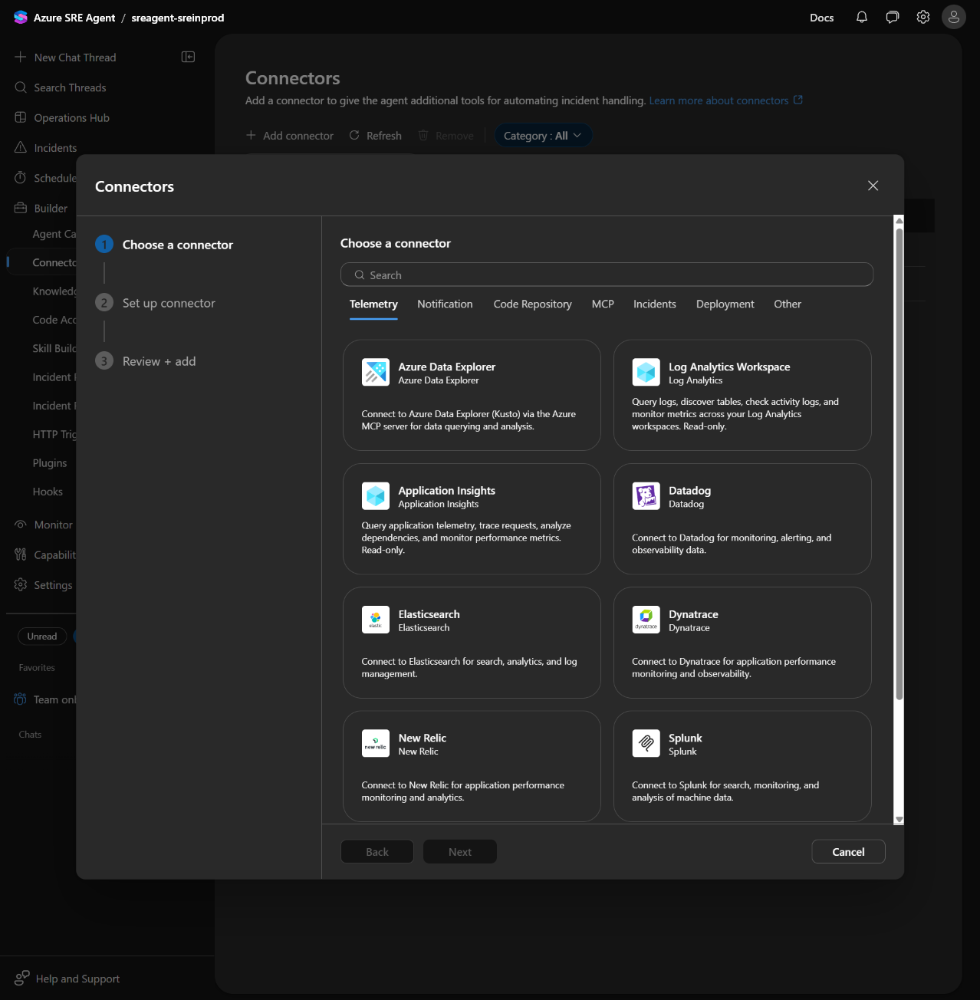
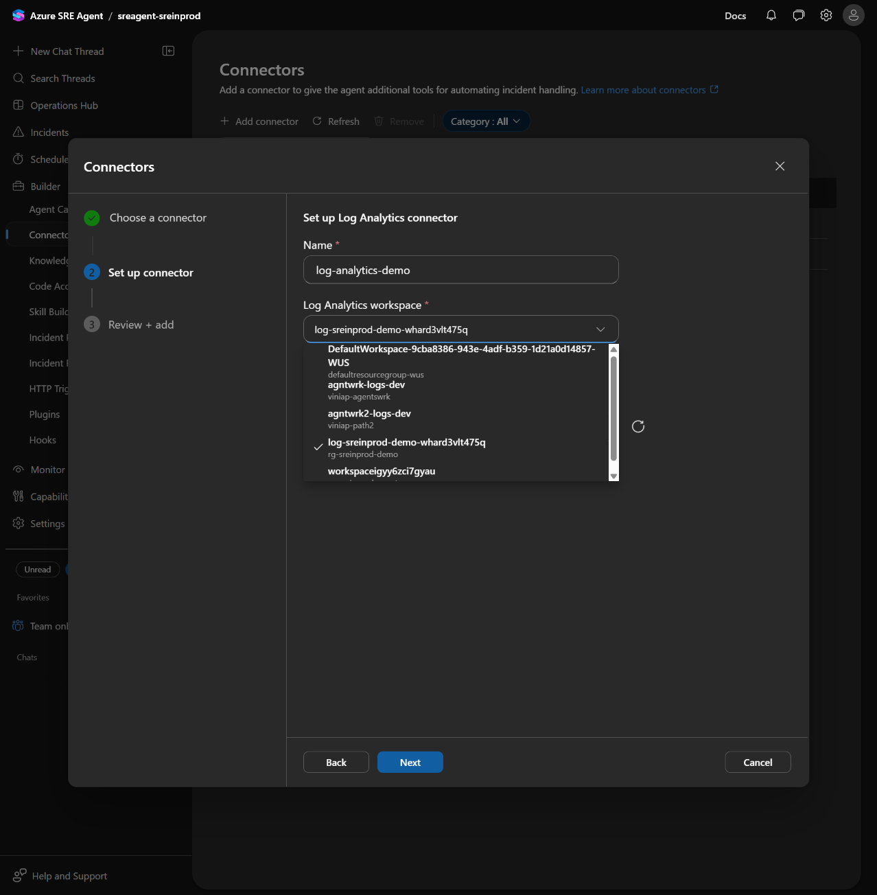
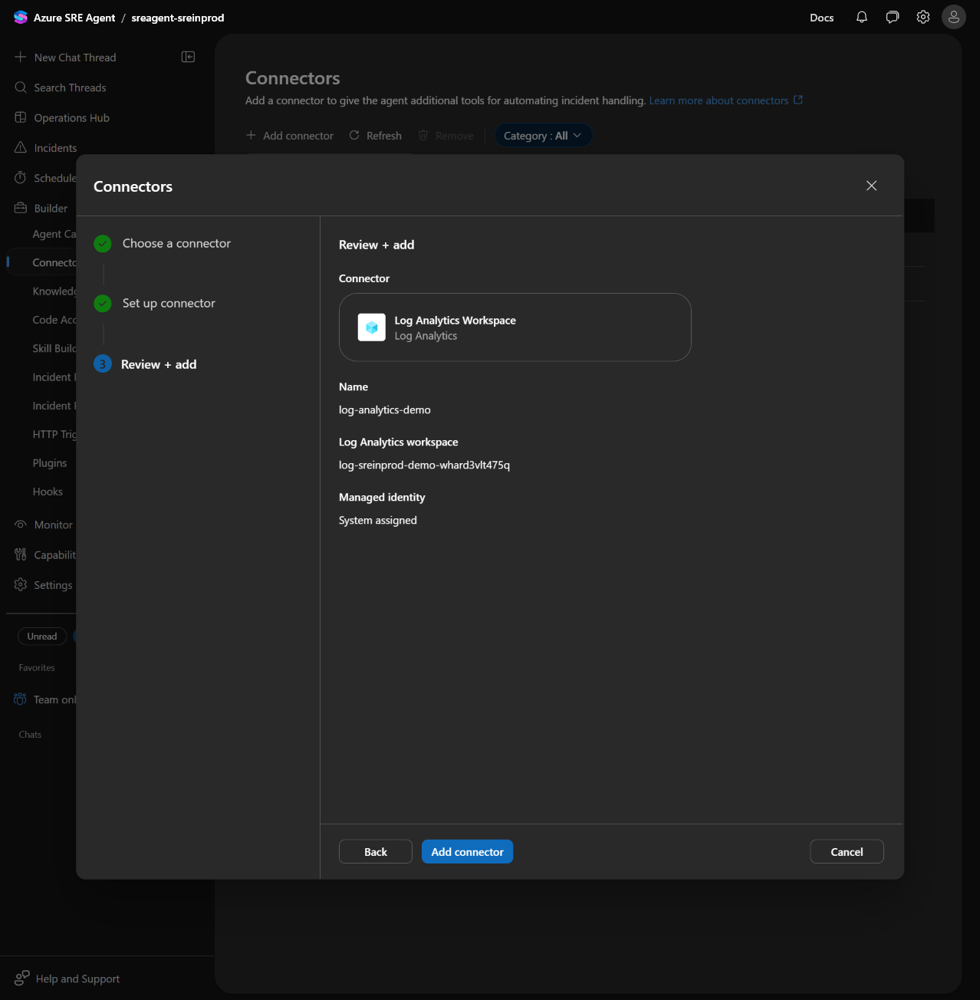
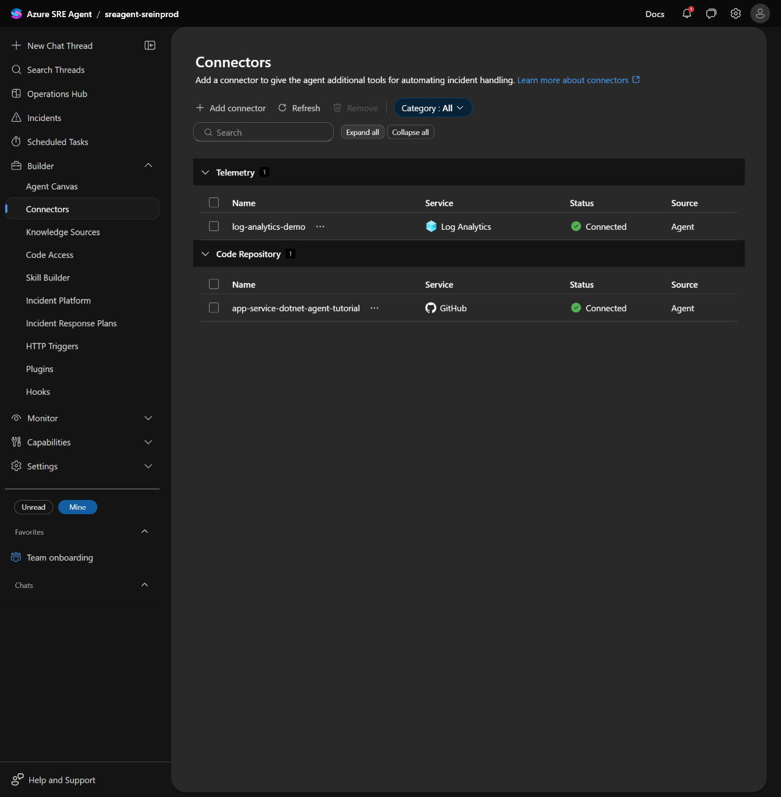
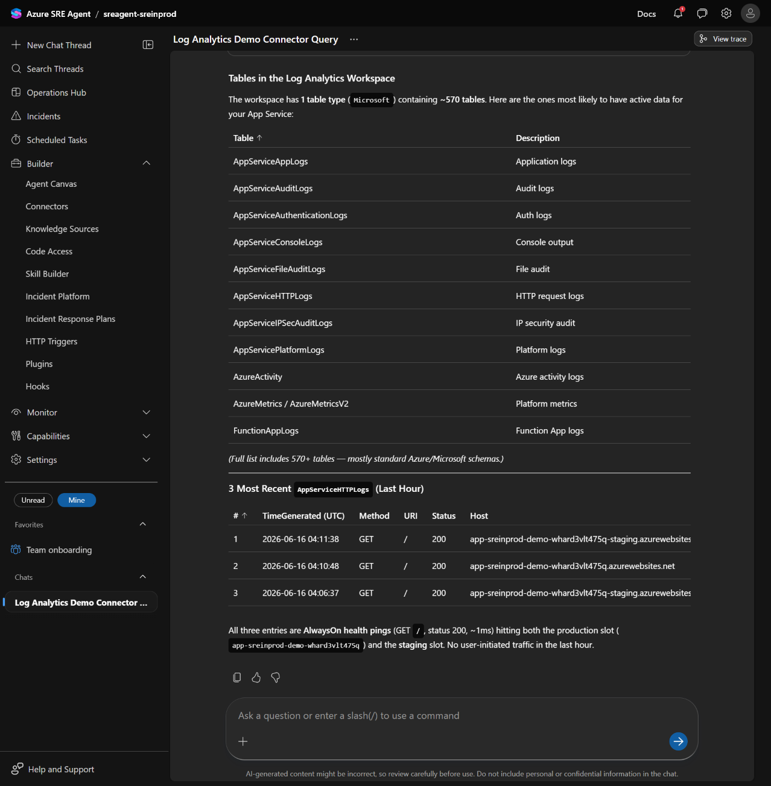

# Module 3 - Connectors

[← Module 2: Deploy the Agent](./2-Deploy-Agent.md) | [Workshop home](./ReadMe.md) | [Next: Module 4 →](./4-Connect-Observability.md)

[Learning companion: connector concepts, discussion, and reference](../Learning/3-Connectors.md)

## Objective

Add a named **Log Analytics Workspace** connector to the agent and validate that it can query the workshop workspace.

In this module the participants:

1. Open the **Connectors** page on the agent.
2. Walk the catalog and pick a tile they recognise.
3. Add a **Log Analytics Workspace** connector pointing at the workshop's workspace `log-sreinprod-demo-<suffix>`.
4. Validate from chat that the agent can now see tables and rows in that workspace.
5. Discuss when to add, scope, or remove a connector.

> Time: ~25 min (5 min framing, 15 min hands-on, 5 min discussion).
> Prereq: a working agent from Module 2 (`sreagent-sreinprod`), and the `log-sreinprod-demo-<suffix>` workspace from Module 1 (visible in `scripts/env.conf`).

## Lab steps

> The portal at `https://sre.azure.com` exposes a **3-step Add connector wizard**: `Choose a connector`, `Set up connector`, and `Review + add`.

### At a glance

The lab is 7 steps.

1. **Step 1:** In the agent, **`Builder`** -> **`Connectors`** opens the page.
2. **Step 2:** Toolbar **`+ Add connector`** opens the 3-step wizard.
3. **Step 3:** On the **Telemetry** tab, tick **`Log Analytics Workspace`**, click **`Next`**.
4. **Step 4:** Fill **Name** = `log-analytics-demo`, pick the workshop workspace, leave **Managed identity** = `System assigned`, click **`Next`**. (If needed, grant **Log Analytics Reader** to the agent's MI first.)
5. **Step 5:** On **Review + add**, click **`Add connector`**.
6. **Step 6:** Open a **`+ New Chat Thread`** and paste the validation prompt. Confirm tables + KQL rows return.
7. **Step 7:** Decide whether to keep or delete the connector via the row's **`...`** kebab menu.

### Step 1: Open the Connectors page

> **Action:**
>
> 1. Open the agent at `https://sre.azure.com/agents/subscriptions/<subId>/resourceGroups/rg-sreinprod-agent/providers/Microsoft.App/agents/sreagent-sreinprod`.
> 2. In the left navigation, expand **`Builder`** and click **`Connectors`**.

Confirm the page already shows **`Code Repository (1)`** with the `app-service-dotnet-agent-tutorial` row from Module 2.

### Step 2: Open the **Add connector** wizard

> **Action:** Click **`+ Add connector`** on the toolbar.

### Step 3: **Choose a connector** - pick **Log Analytics Workspace**



Tick the checkbox on the **`Log Analytics Workspace`** tile. The tile's checkbox toggles to checked and the **`Next`** button activates.

> 🐞 **Known gotcha:** clicking the body of a tile sometimes only highlights it without toggling its checkbox. If **`Next`** stays disabled, click the small checkbox at the top-left corner of the tile directly.

> **Action:** Tick the checkbox on the **`Log Analytics Workspace`** tile, then click **`Next`**.

### Step 4: **Set up connector** - configure the workspace

The dialog header changes to **"Set up Log Analytics connector"**. Three required fields:



| Field | Workshop value | Notes |
| --- | --- | --- |
| **Name\*** | `log-analytics-demo` | This is how the agent will refer to the connector in chat. Lowercase, hyphenated. |
| **Log Analytics workspace\*** | `log-sreinprod-demo-<suffix>` (make sure you select the RG created with the workshop) | Combobox listing every workspace the *agent's identity* can already see. Pick the one Module 1 created. |
| **Managed identity\*** | **`System assigned`** *(default)* | Leave the default. |

> ℹ️ After you pick the workspace, the banner reads *"Log Analytics Reader role needed on: `<rg-name>`"*. The wizard does not grant the role. Without **Log Analytics Reader** on the RG holding the workspace, the connector lands in **`Status: Failed`** instead of **`Connected`**. If needed, grant the role explicitly:
>
> ```powershell
> $miId = az resource show `
>   --resource-group rg-sreinprod-agent `
>   --name sreagent-sreinprod `
>   --resource-type "Microsoft.App/SREAgents" `
>   --query "identity.principalId" -o tsv
> az role assignment create `
>   --assignee-object-id $miId `
>   --assignee-principal-type ServicePrincipal `
>   --role "Log Analytics Reader" `
>   --scope "/subscriptions/<subId>/resourceGroups/rg-sreinprod-demo"
> ```
>
> Alternatively, point the connector at the workspace under `rg-sreinprod-app` (the one created by `azd up` for the demo web app), since the agent already holds `Log Analytics Reader` there from Module 2's Privileged-mode role assignment.

> **Action:** Fill the three fields above, then click **`Next`**.

### Step 5: **Review + add** - commit the connector

The dialog header changes to **"Review + add"** and echoes back the four values you set:



| Section | Value |
| --- | --- |
| **Connector** | Log Analytics Workspace (subtitle: Log Analytics) |
| **Name** | `log-analytics-demo` |
| **Log Analytics workspace** | `log-sreinprod-demo-<suffix>` |
| **Managed identity** | `System assigned` |

> **Action:** Click **`Add connector`**.

The dialog closes and the **Connectors** page lists two groups:



| Group | Row | Service | Status | Source |
| --- | --- | --- | --- | --- |
| **Telemetry (1)** | `log-analytics-demo` | Log Analytics | ✅ Connected | Agent |
| **Code Repository (1)** | `app-service-dotnet-agent-tutorial` | GitHub | ✅ Connected | Agent |

> ⚠️ If the Telemetry row reads anything other than **Connected**, hover the status to read the inline error. The two most common failures are:
>
> - **Permission error**: the agent's managed identity is missing **Log Analytics Reader** on the workspace's RG. Grant it as shown in Step 4 and click the toolbar **`↻ Refresh`**.
> - **Workspace deleted / moved**: the connector keeps the workspace's resource ID. If Module 1's RG was torn down and recreated, edit the connector (kebab menu) to repoint it.

### Step 6: Validate from chat

> **Action:** Open a **`+ New Chat Thread`** in the agent's left rail (the icon at the very top, above **Search Threads**) and ask:

```text
List the table names available in the log-analytics-demo connector and show the 3 most recent AppServiceHTTPLogs entries from the last hour. If AppServiceHTTPLogs has no rows, list whatever tables you do see and show 3 rows from each.
```

A correct answer:



- enumerates standard App Service tables (`AppServiceHTTPLogs`, `AppServiceAppLogs`, `AppServiceConsoleLogs`, `AppServiceAuditLogs`, etc.),
- runs a KQL query against the workspace, and
- returns 3 rows whose `Host` column matches `app-sreinprod-demo-<suffix>.azurewebsites.net` (production) and `app-sreinprod-demo-<suffix>-staging.azurewebsites.net` (staging slot).

> ⚠️ **Failure diagnostic:** An empty result, tables not present in the workspace, or `Host` values that do not match `WEBAPP_NAME` in `scripts/env.conf` indicates a connector, permission, or target-workspace problem. Expected tables include `AppServiceHTTPLogs`, `AppServiceAppLogs`, `AppServiceConsoleLogs`, and `AppServiceAuditLogs`; expected hosts are the production and staging names above. If the rows reference a different web app, repoint the connector.

### Step 7: Manage and clean up

> **Action:** On the SRE Agent portal, return to the Connectors page. Hover the `log-analytics-demo` row and click the **`...`** kebab button.

Two actions are exposed:

| Action | When to use it |
| --- | --- |
| **Edit connector** | Repoint the connector at a different workspace, or rename it. The Set up connector form opens with the existing values. |
| **Delete connector** | Remove the connector entirely. The agent's managed identity keeps any RBAC roles you granted on the workspace; clean those up separately if you no longer need them. |

For the workshop you can **leave the connector in place**. Module 4 will use it in chat (the agent picks `log-analytics-demo` over the implicit RBAC path because the connector is named) and Module 6 relies on the agent's ability to read App Service logs.

If your tenant security policy forbids leaving a Log Analytics connector wired to a learning environment, **Delete** the connector at the end of Module 3 and re-add it at the start of Module 4.

## Validation checklist

- [ ] The **Connectors** page shows the **Telemetry (1)** group with `log-analytics-demo` / Log Analytics / Connected / Agent.
- [ ] The agent's managed identity holds **Log Analytics Reader** on the RG holding the workspace.
- [ ] In chat, the agent can list tables in the workspace and run KQL against `AppServiceHTTPLogs`.
- [ ] The host names returned by KQL match the `WEBAPP_NAME` recorded in `scripts/env.conf`.
- [ ] The kebab (`...`) menu on the row exposes **Edit connector** and **Delete connector**, and you know which one your security policy will require at the end of the workshop.

## Learning summary

You added a named Log Analytics connector, granted the agent's managed identity the required read scope, validated real KQL results from chat, and reviewed how to edit or remove the connection safely.

[Read the connector concepts, discussion prompts, and full screenshot reference →](../Learning/3-Connectors.md)

[← Module 2: Deploy the Agent](./2-Deploy-Agent.md) | [Workshop home](./ReadMe.md) | [Next: Module 4 →](./4-Connect-Observability.md)
