# Module 4 - Connect Observability

[← Module 3: Connectors](./3-Connectors.md) | [Workshop home](./ReadMe.md) | [Next: Module 5 →](./5-Response-Plans-and-Guardrails.md)

[Learning companion: observability concepts, discussion, and reference](../Learning/4-Connect-Observability.md)

## Objective

Take the connector you added in Module 3 and turn it into an **incident-investigation workflow**. In this module the participants:

1. Add a **second** telemetry connector, **Application Insights**, so the agent has two named telemetry surfaces (`log-analytics-demo` for App Service logs and `app-insights-demo` for APM signals).
2. Run a single chat prompt that forces the agent to cite **which connector each fact came from**, then reach a healthy / unhealthy verdict.
3. Inspect the resulting **trace** to see exactly which tools the model invoked and how long each step took.
4. Tour the agent's **Monitor** surfaces (`Session Insights`, `Resource Mapping`, `Logs`) and the **Operations Hub** so participants know where to look when an incident is in flight.

> Time: ~30 min (5 min framing, 20 min hands-on, 5 min discussion).
> Prereq: Module 3 complete with `log-analytics-demo` showing **Connected** in the Telemetry group, and an Application Insights resource `appi-sreinprod-demo-<suffix>` (created by Module 1 / `infra/main.bicep`, surfaced in `scripts/env.conf` as `APP_INSIGHTS_NAME`).

## Lab steps

> All lab steps run against the live agent at `https://sre.azure.com/agents/subscriptions/<subId>/resourceGroups/rg-sreinprod-agent/providers/Microsoft.App/agents/sreagent-sreinprod`.

### At a glance

The lab is 7 steps.

1. **Step 1:** **`Builder`** -> **`Connectors`** -> **`+ Add connector`** -> tick **`Application Insights`** -> **`Next`**.
2. **Step 2:** Fill **Name** = `app-insights-demo`, pick the workshop App Insights resource, leave **Managed identity** = `System assigned`, click **`Next`**. (If needed, grant **Reader** to the agent's MI on the App Insights RG first.)
3. **Step 3:** On **Review + add**, click **`Add connector`**.
4. **Step 4:** Open a **`+ New Chat Thread`** and paste the cited investigation prompt verbatim.
5. **Step 5:** Click **`View trace`** in the chat footer to inspect the span tree.
6. **Step 6:** Tour the **Monitor** sub-nav: **Session Insights**, **Resource Mapping**, **Logs**, **Azure Managed Grafana**.
7. **Step 7:** Open **`Operations Hub`** and verify the **`Active Connectors (4)`** card and the **`Daily Volume by Source`** chart.

### Step 1: Add the **Application Insights** connector

> **Action:** In the agent's left rail, expand **`Builder`** and click **`Connectors`**.

The page from Module 3 should already show **Telemetry (1)** with `log-analytics-demo` and **Code Repository (1)** with `app-service-dotnet-agent-tutorial`.

> **Action:** Click **`+ Add connector`**.

The same 3-step wizard from Module 3 opens. On the **`Choose a connector`** step, leave the **`Telemetry`** tab selected and pick the **`Application Insights`** tile.

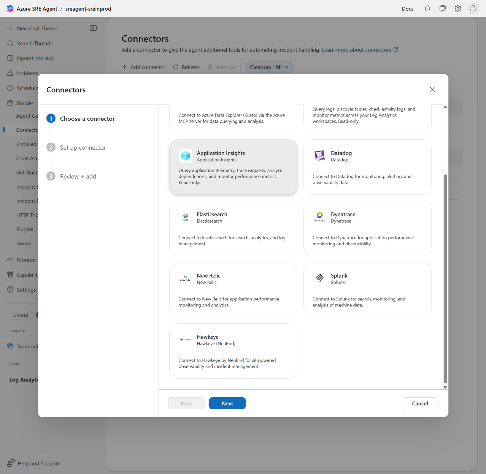

> 🐞 **Same gotcha as Module 3.** Clicking the body of the tile sometimes only highlights it. If `Next` stays disabled, click the small checkbox at the top-left corner of the tile.

> **Action:** Tick the **`Application Insights`** tile and click **`Next`**.

### Step 2: **Set up Application Insights connector**

The header changes to **"Set up Application Insights connector"**. Three required fields:

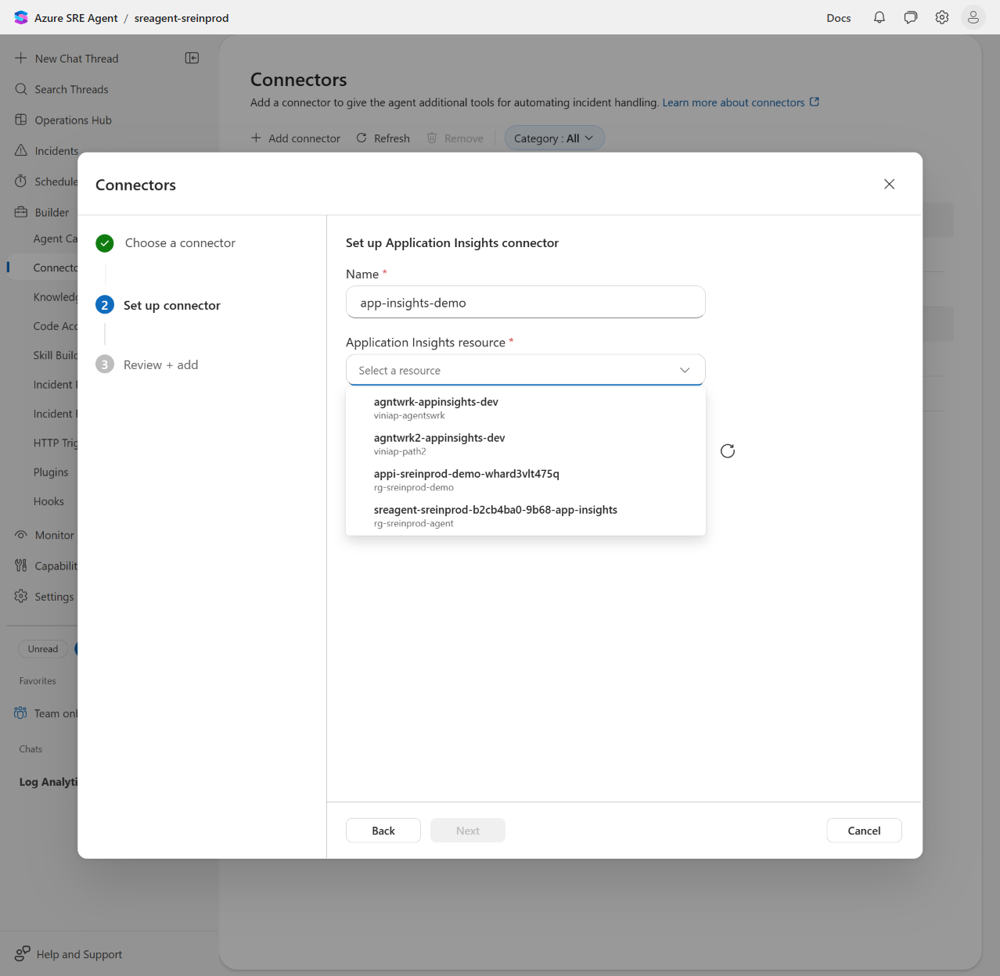

| Field | Workshop value | Notes |
| --- | --- | --- |
| **Name\*** | `app-insights-demo` | The chat-friendly name. Lowercase, hyphenated. The agent will refer to this connector by this exact string in trace data. |
| **Application Insights resource\*** | `appi-sreinprod-demo-<suffix>` (resource group `rg-sreinprod-demo`) | Combobox listing every App Insights resource the agent's identity can already see. Pick the workshop one. |
| **Managed identity\*** | **`System assigned`** *(default)* | Same identity the agent was deployed with in Module 2. Leave the default. |

> ℹ️ **The required role differs from Module 3.** Once you pick the resource, an info banner reads:
>
> > *"Reader role needed on: rg-sreinprod-demo"*
>
> 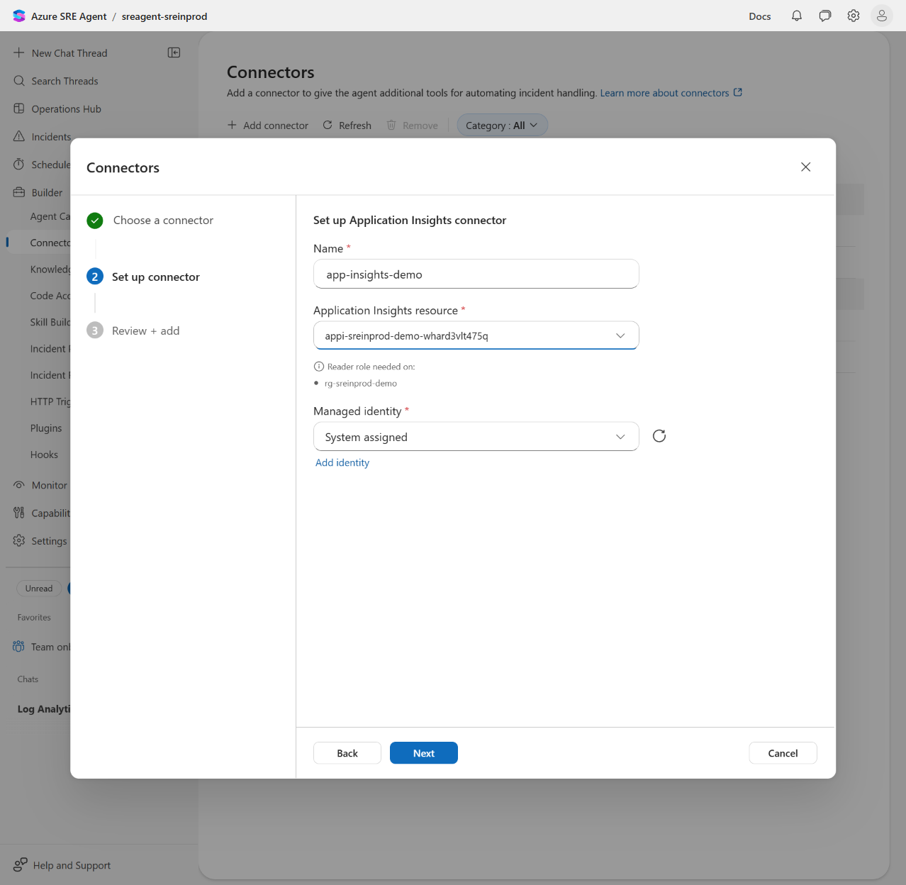
>
> The Application Insights connector requires **`Reader`** on the resource group, not the **`Log Analytics Reader`** role required by Module 3. The wizard does not grant it. If the agent's identity does not already have `Reader` on `rg-sreinprod-demo`:
>
> ```powershell
> $miId = az resource show `
>   --resource-group rg-sreinprod-agent `
>   --name sreagent-sreinprod `
>   --resource-type "Microsoft.App/SREAgents" `
>   --query "identity.principalId" -o tsv
> az role assignment create `
>   --assignee-object-id $miId `
>   --assignee-principal-type ServicePrincipal `
>   --role "Reader" `
>   --scope "/subscriptions/<subId>/resourceGroups/rg-sreinprod-demo"
> ```

> **Action:** Fill the three fields above, then click **`Next`**.

### Step 3: **Review + add**

The **Review + add** pane echoes back the four values you set. Verify the **Application Insights resource** matches `APP_INSIGHTS_NAME` from `scripts/env.conf`.

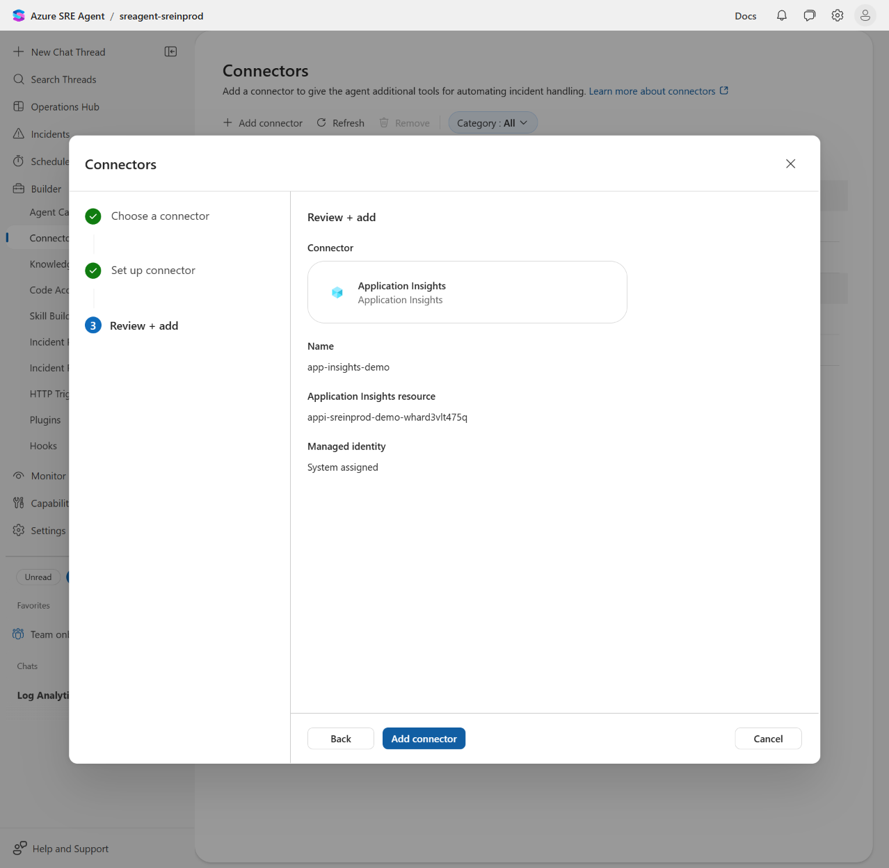

> **Action:** Click **`Add connector`**.

The dialog closes and the **Connectors** page now lists two telemetry connectors:

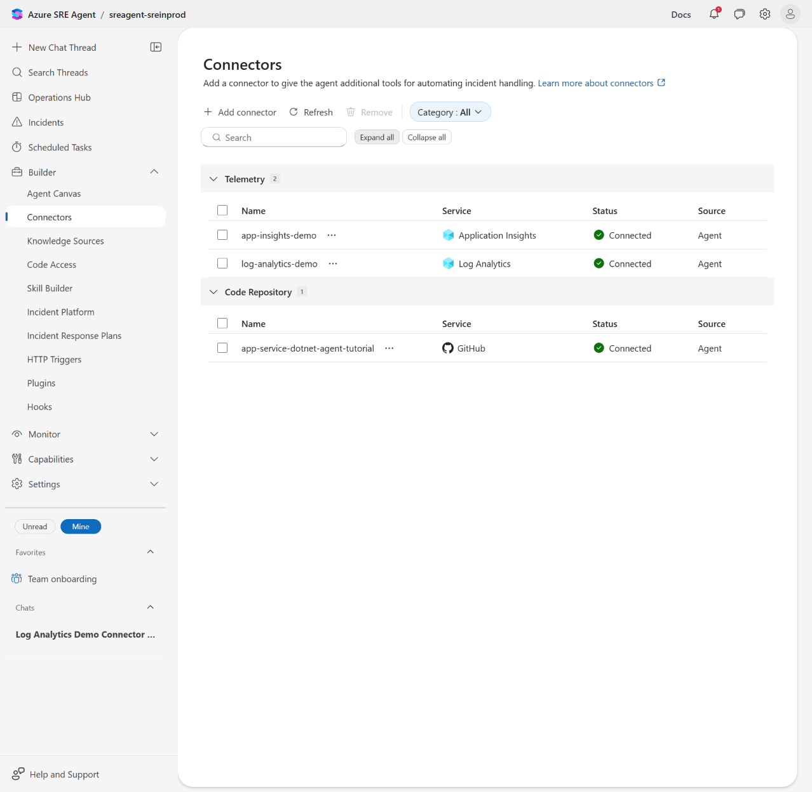

| Group | Row | Service | Status | Source |
| --- | --- | --- | --- | --- |
| **Telemetry (2)** | `app-insights-demo` | Application Insights | ✅ Connected | Agent |
| **Telemetry (2)** | `log-analytics-demo` | Log Analytics | ✅ Connected | Agent |
| **Code Repository (1)** | `app-service-dotnet-agent-tutorial` | GitHub | ✅ Connected | Agent |

> ⚠️ If `app-insights-demo` lands in **Failed** rather than **Connected**, hover the status: missing **`Reader`** on `rg-sreinprod-demo` is the dominant cause. Grant it via the snippet in Step 2 and click **`↻ Refresh`** on the toolbar.

### Step 4: Run the cited investigation prompt

> **Action:** Open a **`+ New Chat Thread`** and paste the prompt **verbatim**:

```text
Investigate app-sreinprod-demo-<suffix> for the last 1 hour. Use the
app-insights-demo connector for request volume, failure rate, and the
top 3 exception types. Use the log-analytics-demo connector for the
AppServiceHTTPLogs status-code distribution and the most recent
AppServiceConsoleLogs entry. Also list the App Service alert rules
currently configured. Then summarize: is this app healthy right now?
Cite which connector each fact came from.
```

Replace `<suffix>` with the value from `scripts/env.conf` (`WEBAPP_NAME` minus the `app-sreinprod-demo-` prefix).

A correct answer auto-titles the thread something like **"App Service Health Diagnostics"** and replies with a table that **names the connector for every row**, plus an explicit verdict at the bottom:

> 💡 **AI and non-deterministic answers:** Keep in mind that AI-generated answers are non-deterministic and may vary slightly each time. If your answer doesn't match the following sample, review the content of the provided output to ensure the overall outcome is the same.

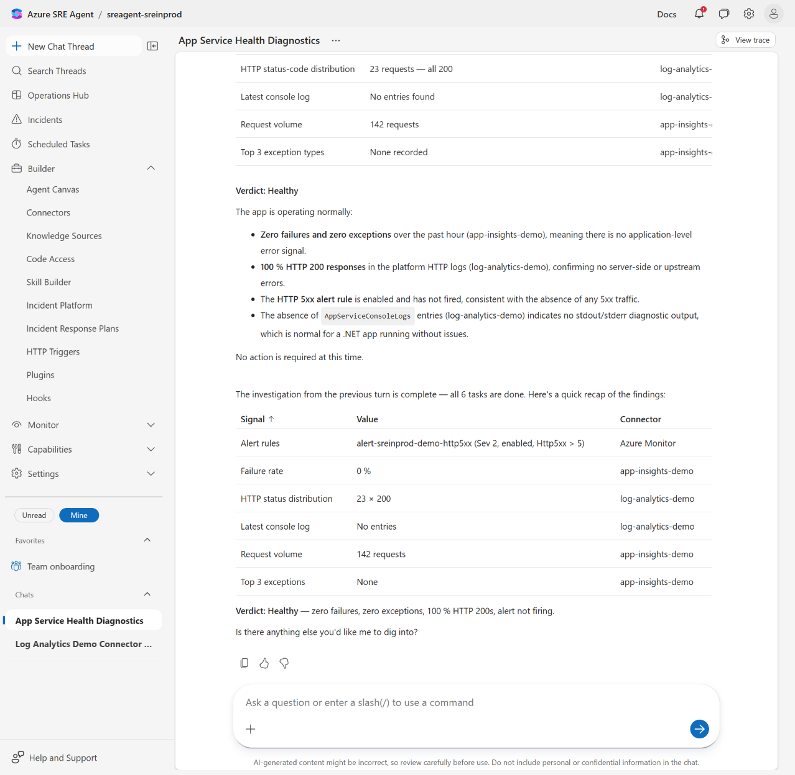

A passable answer for a healthy demo workload looks like this (your numbers will vary):

| Signal | Value | Source |
| --- | --- | --- |
| Alert rules | `alert-sreinprod-demo-http5xx` (Sev 2, enabled, condition `Http5xx > 5`) | Azure Monitor |
| Failure rate | 0% | `app-insights-demo` |
| HTTP status distribution | 23 × 200 | `log-analytics-demo` |
| Latest console log entry | No entries | `log-analytics-demo` |
| Request volume | 142 requests | `app-insights-demo` |
| Top 3 exception types | None | `app-insights-demo` |

Followed by a **Verdict: healthy** paragraph that lists the data points it used.

> ⚠️ **Failure diagnostic:** If the answer skips a citation or a requested signal, verify both connector statuses and confirm the agent has `Reader` and `Log Analytics Reader` at the scopes listed in the validation checklist.

> 💡 **Cross-check.** The `Alert rules` row should match Module 1's `infra/main.bicep` exactly: rule name `alert-sreinprod-demo-http5xx`, severity 2, enabled, condition `Http5xx > 5`. If the rule is missing, Module 1 was not deployed correctly and Module 6's smoke test will fail.

### Step 5: Inspect the trace via **`View trace`**

> **Action:** In the chat thread's footer, click **`View trace`**.

A modal opens with the thread ID, the agent name, your user identity, and a span tree:

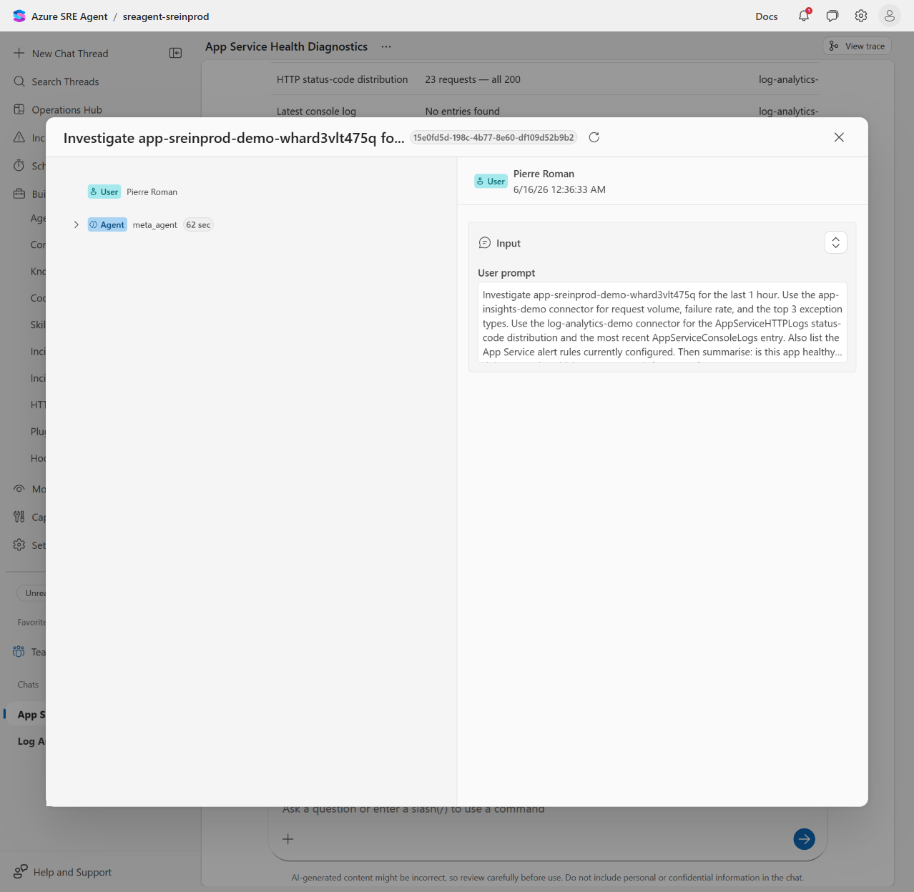

> **Action:** Expand the **`meta_agent`** span.

The tree shows:

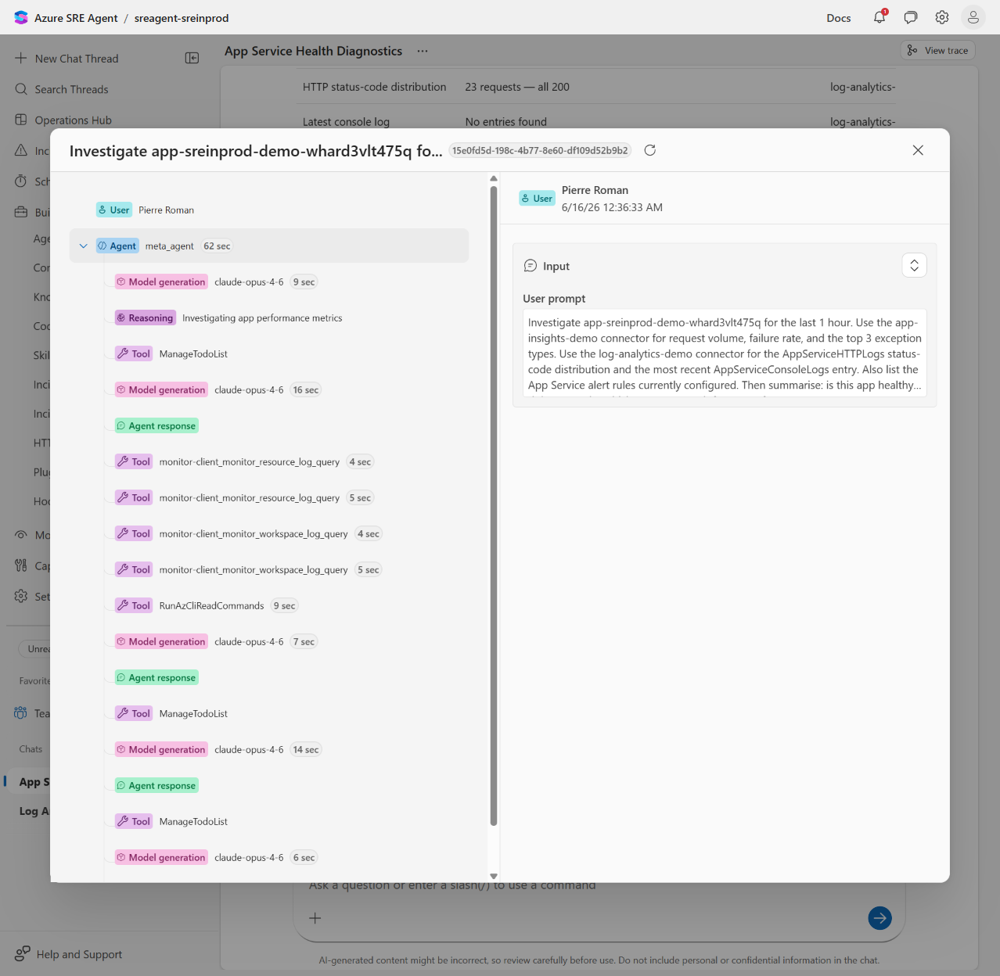

Confirm the expanded tree contains model generation, reasoning, and tool-call spans. Expected calls include `monitor-client_monitor_resource_log_query`, `monitor-client_monitor_workspace_log_query`, and `RunAzCliReadCommands`; tool names may use the `monitor-client_*` prefix.

Close the trace dialog.

### Step 6: Tour the **Monitor** sub-nav

> **Action:** Collapse **Builder** in the left rail and expand **Monitor**.

Three pages plus an external link:

#### Session Insights

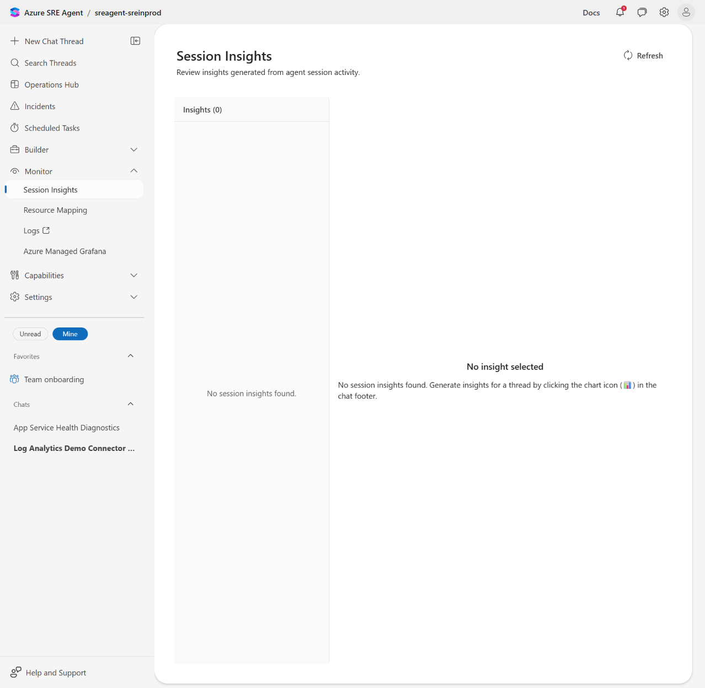

> **Action:** Click **`Session Insights`** and confirm the workshop empty state, then continue.

#### Resource Mapping

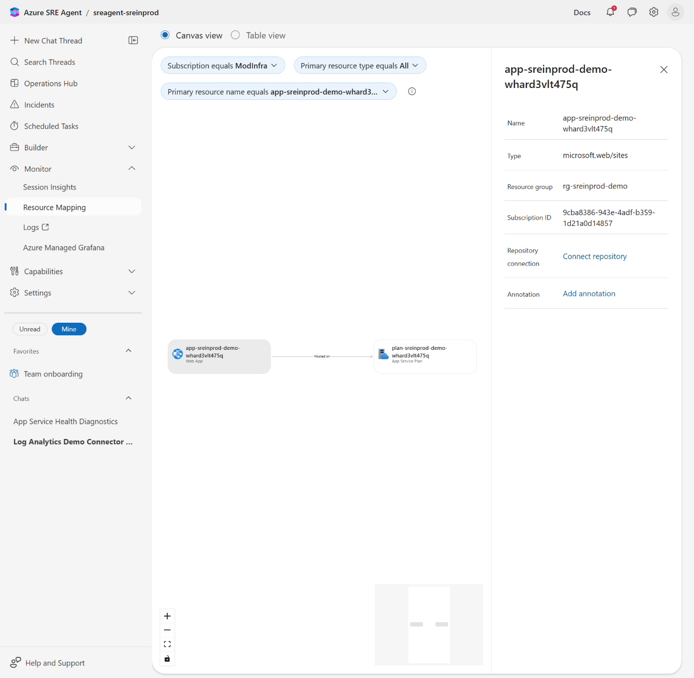

> **Action:** Click **`Resource Mapping`**, select **`Canvas view`**, and filter to `app-sreinprod-demo-<suffix>` if needed.

For the workshop, the canvas should show two boxes connected by a **`Hosted on`** arrow:

- `app-sreinprod-demo-<suffix>` (Web App, `microsoft.web/sites`, `rg-sreinprod-demo`)
- `plan-sreinprod-demo-<suffix>` (App Service Plan)

> **Action:** Select the Web App box and confirm the details panel exposes **`Connect repository`** and **`Add annotation`**. Do not change either field in this module.

#### Logs (external link)

> **Action:** Click **`Logs`**, confirm it opens the Azure portal Log Analytics blade in a new tab, then close that tab.

#### Azure Managed Grafana

> **Action:** If **`Azure Managed Grafana`** is present, open it and confirm the workshop empty state, then continue.

> 🐞 **No Azure Managed Grafana** If you don't see the Azure Managed Grafana option, it means your environment doesn't have any Grafana instances connected.

### Step 7: Land on the **Operations Hub**

> **Action:** Click the **`Operations Hub`** entry near the top of the left rail.

This is the agent's landing page once you have done a couple of investigations:

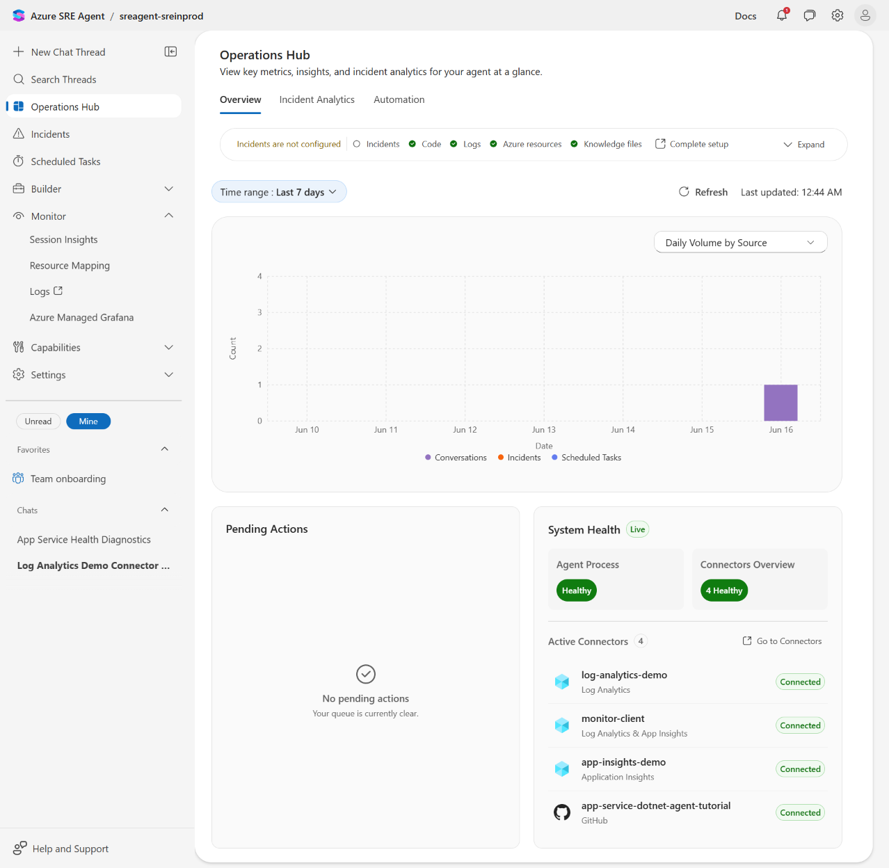

> **Action:** Confirm:
>
> - **Daily Volume by Source** shows today's conversation.
> - **Pending Actions** reads **`No pending actions`** / **`Your queue is currently clear.`**
> - **System Health** reads **`Agent Process: Healthy`** and **`Connectors Overview: 4 Healthy`**.
> - **Active Connectors (4)** lists `log-analytics-demo`, `monitor-client` (built-in), `app-insights-demo`, and `app-service-dotnet-agent-tutorial`, all **Connected**.

## Validation checklist

- [ ] **Connectors** page shows **Telemetry (2)** with both `log-analytics-demo` and `app-insights-demo` reading **Connected**.
- [ ] The agent's managed identity holds `Reader` on `rg-sreinprod-demo` and `Log Analytics Reader` on the RG containing `log-sreinprod-demo-<suffix>`.
- [ ] In a fresh chat thread, the cited investigation prompt returns a **table** with **per-fact connector attribution** and an explicit verdict.
- [ ] **`View trace`** opens a span tree with model name (`claude-opus-4-6` at the time of writing), reasoning steps, and tool calls prefixed `monitor-client_*`.
- [ ] **Operations Hub** lists exactly **4 Active Connectors**: `log-analytics-demo`, `monitor-client` (built-in), `app-insights-demo`, `app-service-dotnet-agent-tutorial`. Agent Process is **`Healthy`**.
- [ ] **Resource Mapping** shows the Web App / App Service Plan pair from Module 1. The right-hand details panel exposes **`Connect repository`** and **`Add annotation`** links.

## Learning summary

You connected Application Insights, investigated one workload through two named telemetry sources, verified tool routing in the trace, and located the agent's monitoring and operational views.

[Read the observability concepts, discussion prompts, and full screenshot reference →](../Learning/4-Connect-Observability.md)

[← Module 3: Connectors](./3-Connectors.md) | [Workshop home](./ReadMe.md) | [Next: Module 5 →](./5-Response-Plans-and-Guardrails.md)
