# Module 5 - Response Plans and Guardrails

[← Module 4: Connect Observability](./4-Connect-Observability.md) | [Workshop home](./ReadMe.md) | [Next: Module 6 →](./6-Incident-Drill.md)

## Objective

Configure how the agent **acts** on the telemetry it now sees. In this module the participants:

1. Connect an **Incident Platform** (Azure Monitor) so the agent has a real incident inbox to react to, and let the **Quickstart** toggle bootstrap a default Sev3 response plan.
2. Open the auto-created `quickstart_response_plan`, turn it into a **custom** plan, and supply natural-language instructions that the portal converts into a structured `EXECUTION_PLAN`.
3. Tour **Manage tools** and learn that the tool catalog itself is the primary guardrail surface, including the verbatim guardrail prose that ships on mutating tools like `RunAzCliWriteCommands`.
4. Pick an **Autonomy level** (`Review` vs `Autonomous`), set the **Alert reinvestigation cooldown**, save the plan, and confirm it lands as `Created / On / Review` on the Incident Response Plans table.

> Time: ~30 min (5 min framing, 20 min hands-on, 5 min discussion).
> Prereq: Module 4 complete with both **Telemetry (2)** connectors `log-analytics-demo` and `app-insights-demo` reading **Connected**.

## What this module adds (and what it does not)

| Aspect | What it is | What it is not |
| --- | --- | --- |
| **Incident Platform** | A *one-per-agent* connection (`PagerDuty`, `ServiceNow`, or `Azure Monitor`) that lets the agent **subscribe to incidents**, not just queries from chat. Wired under **`Builder` → `Incident Platform`**. Picking **Azure Monitor** is zero-provisioning: the agent listens to notifications from the resource groups it already manages. | A telemetry connector. Connectors (Module 4) answer "what is happening right now"; the Incident Platform answers "an alert just fired - take it". |
| **Incident Response Plan** | A *per-severity* (or per-title) policy that wraps every matching incident with: a generated `EXECUTION_PLAN`, an allow-listed `Manage tools` set, an `Autonomy level`, and an `Alert reinvestigation cooldown`. Saved plans live under **`Builder` → `Incident Response Plans`**. | A chat prompt. Chat is opt-in per thread; a response plan **fires on its own** when a matching incident arrives. |
| **Quickstart Response Plan** | A toggle on the Incident Platform setup that auto-creates `quickstart_response_plan` (Sev3, Status `On`) the moment Azure Monitor connects. The portal warns: *"This will create an autonomous response plan that begins processing incidents immediately after the platform is connected."* | Safe-by-default. Quickstart's row reads **Autonomy: Review** on the table, but opening the plan and ticking *"I want a custom response plan"* resets the autonomy radio to **`Autonomous (Default)`** in the wizard. Always re-verify the radio on the **`Save response plan`** step. |
| **Manage tools** picker | A modal listing every tool the agent ships with (alphabetical), with `Search` over both **Tool** and **Description**. The descriptions encode the guardrail rules (e.g. `RunAzCliWriteCommands`: *"FORBIDDEN: 'delete', 'remove', 'aks command invoke'"*). | The only guardrail. The textual `EXECUTION_PLAN` says *"do not execute it"* but the **Suggested tools** list still includes mutating tools like `UpdateAppSettings` by default. Removing dangerous tools from this picker is the **structural** guardrail; relying on plan prose alone is not. |
| **Autonomy level** | A two-value radio on the final wizard step: **`Autonomous (Default)`** (agent analyzes *and* remediates) vs **`Review`** (agent analyzes, then waits for human approval). Surfaces on the table's **Autonomy level** column. | A per-incident toggle. The autonomy is bound to the *plan*, not the *incident*. Two plans can route different severities to different autonomy postures, but a single plan cannot ask per-fire. |

For the wider response plan catalog (PagerDuty, ServiceNow, programmatic plan creation) see [Incident response plans in Azure SRE Agent](https://go.microsoft.com/fwlink/?linkid=2341945).

## Lab steps

> All lab steps run against the live agent at `https://sre.azure.com/agents/subscriptions/<subId>/resourceGroups/rg-sreinprod-agent/providers/Microsoft.App/agents/sreagent-sreinprod`.

### At a glance

The lab is 9 steps. Each step below adds the context and the *why*.

1. **Step 1:** **`Builder`** -> **`Incident Response Plans`** -> click **`Connect an incident platform`**.
2. **Step 2:** Pick **Azure Monitor** in the dropdown, leave **Quickstart toggle ON**, click **`Save`**.
3. **Step 3:** Back on **Incident Response Plans**, confirm the new `quickstart_response_plan` row.
4. **Step 4:** Click the `quickstart_response_plan` link, tick **`I want a custom response plan.`**, click **`Next`**.
5. **Step 5:** Paste the workshop instructions into the **`Enter instructions`** textarea, click **`Generate + review`**.
6. **Step 6:** Read the generated `### EXECUTION_PLAN ###` and the **Suggested tools** table; spot the `UpdateAppSettings` gap.
7. **Step 7:** Click **`+ Manage tools`**, search `update`, read `RunAzCliWriteCommands`, close with **`Cancel`** (do not add mutating tools for the workshop).
8. **Step 8:** Switch to the **`Test the response plan`** tab, glance at the dry-run surface, then click **`Next`**.
9. **Step 9:** On **Save response plan**, switch the autonomy radio to **`Review`**, leave cooldown at `3 hours`, click **`Save`**.

### Step 1: Open the empty **Incident Response Plans** page

> **Action:** In the agent's left rail, expand **`Builder`** and click **`Incident Response Plans`**.

With no incident platform yet wired, the page renders an empty state:

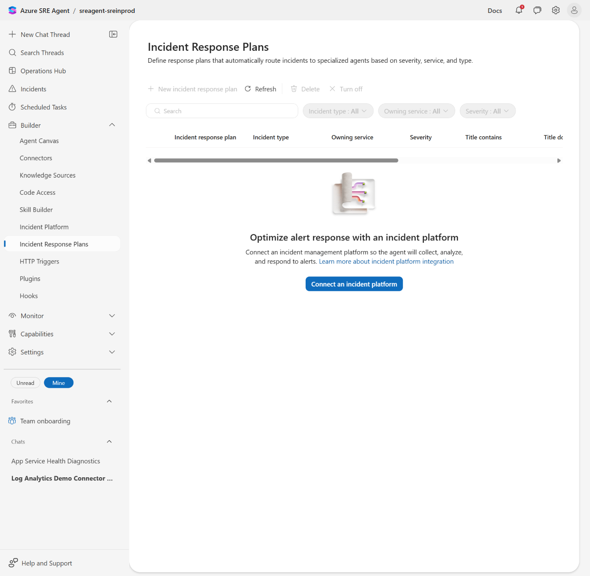

| Surface | Reads |
| --- | --- |
| Page header | **"Incident Response Plans"** |
| Subtitle | *"Define response plans that automatically route incidents to specialized agents based on severity, service, and type."* |
| Toolbar | **`+ New incident response plan`** *(disabled)*, **`↻ Refresh`**, **`🗑 Delete`** *(disabled)*, **`✕ Turn off`** *(disabled)* |
| Empty-state hero | **"Optimize alert response with an incident platform"** / *"Connect an incident management platform so the agent will collect, analyze, and respond to alerts."* |
| CTA | **`Connect an incident platform`** *(blue)* |

> 🔒 **The most important UI fact in this module.** **`+ New incident response plan`** is **disabled** until an incident platform is connected. A response plan without an incident inbox has nothing to fire on. Workshop participants who skip this step end up writing chat prompts and calling them "plans".

> **Action:** Click **`Connect an incident platform`**.

The left rail navigates to **`Incident Platform`** and the page header changes to **"Incident Management"** with the wizard's Step 1 visible.

### Step 2: Connect **Azure Monitor** as the Incident Platform

The platform page reads:

> *"Add an incident platform so that the agent can help respond to incidents in real time. To change to a different platform, you'll need to delete the connection to the current one."*

This is **one platform per agent**. Card **`1 Choose your incident platform`** exposes a single required field, **`Incident Platform *`**, with the placeholder *"Choose a platform"*.

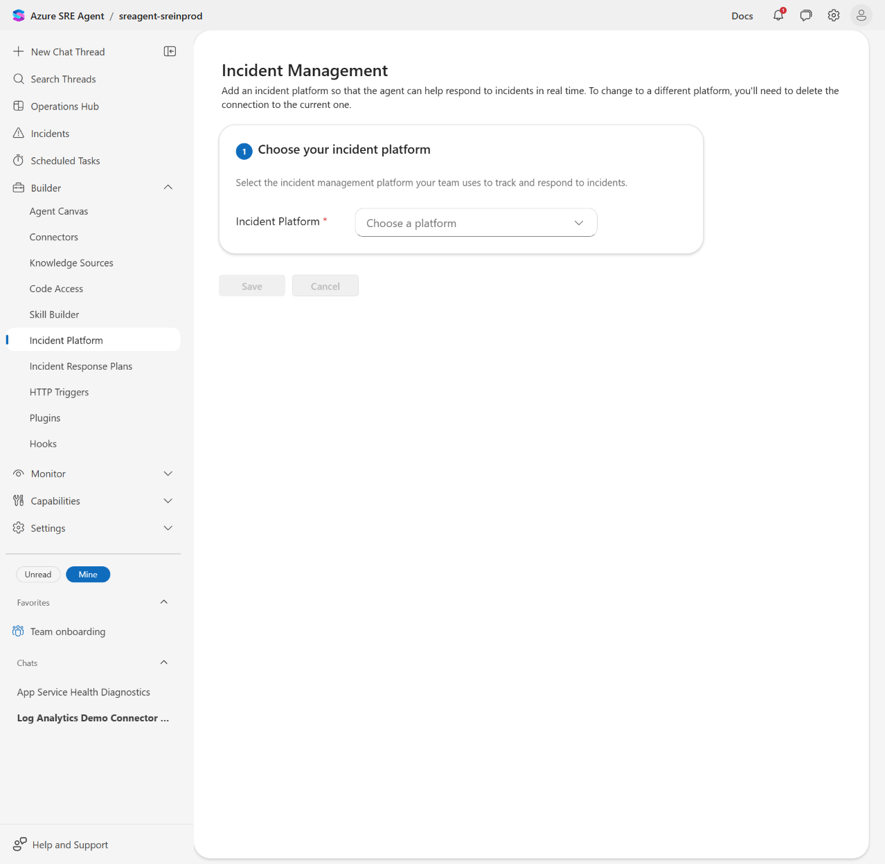

Open the dropdown. Three options in this order:

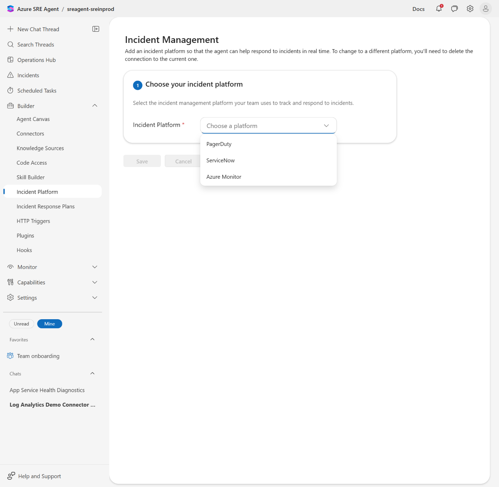

| Option | When to pick |
| --- | --- |
| **PagerDuty** | Production teams already paging via PagerDuty. Requires an integration key. Out of scope for the workshop. |
| **ServiceNow** | Teams routing incidents through ServiceNow ITSM. Requires an instance URL and OAuth app. Out of scope for the workshop. |
| **Azure Monitor** | The workshop choice. **Zero provisioning**: the agent subscribes to notifications from the resource groups it already manages (in this lab, `rg-sreinprod-demo`). |

> **Action:** Select **`Azure Monitor`**.

A platform card expands below the dropdown:

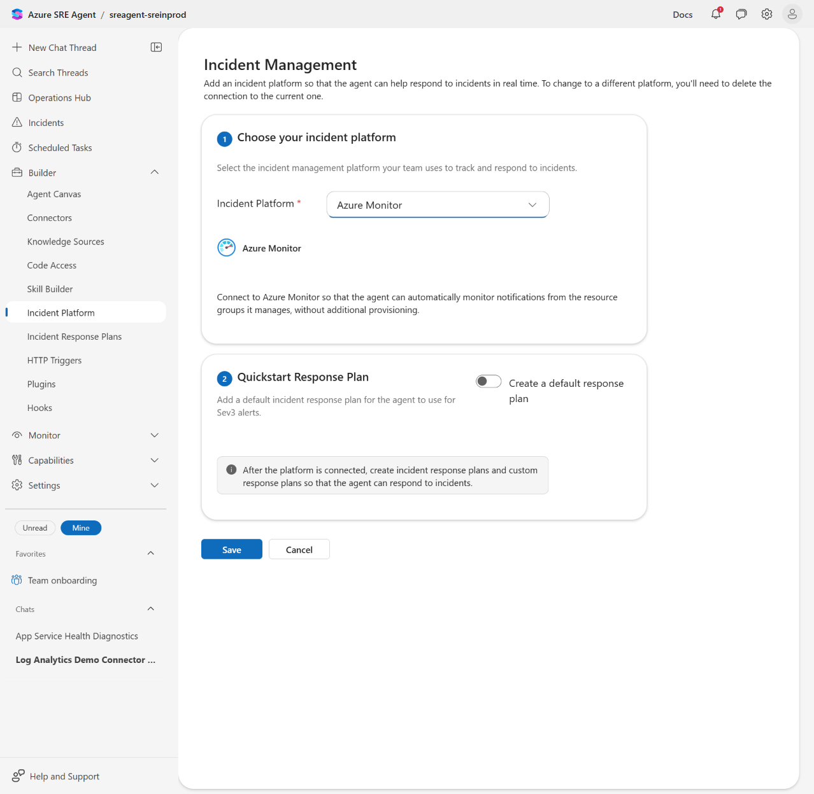

The Azure Monitor card reads:

> *"Connect to Azure Monitor so that the agent can automatically monitor notifications from the resource groups it manages, without additional provisioning."*

A **second** card now appears below: **`2 Quickstart Response Plan`** with a toggle **`Create a default response plan`** *(default: OFF)*. Subtitle: *"Add a default incident response plan for the agent to use for Sev3 alerts."*

Change the toggle to **ON**. A warning banner appears under the toggle:

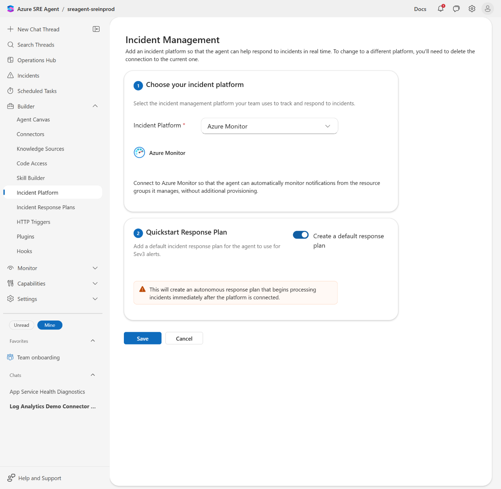

> ⚠️ ***"This will create an autonomous response plan that begins processing incidents immediately after the platform is connected."***

> **Action:** Click **`Save`** at the bottom of the page (becomes active once the platform is chosen).

The page enters a transient **`Connecting...`** state:

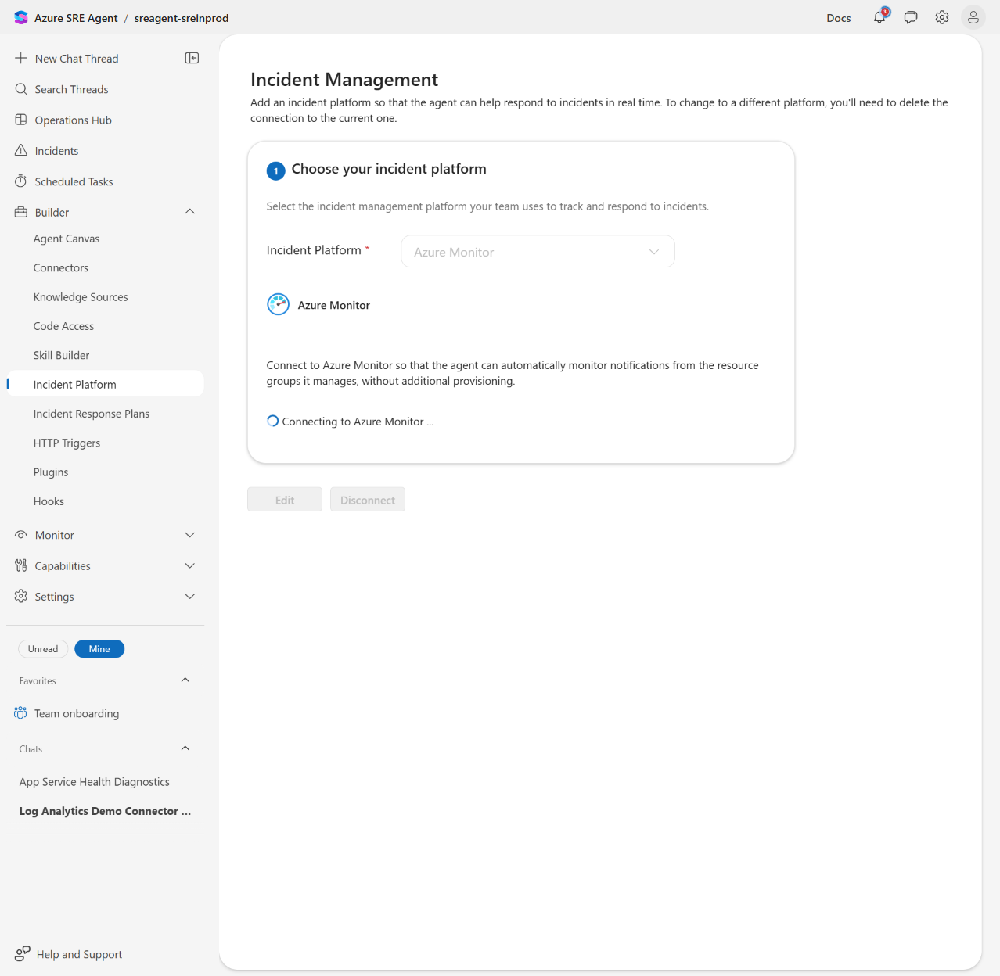

Within a few seconds the connection completes and the wizard collapses to a single connected-state card with **`Edit`** and **`Disconnect`** buttons:

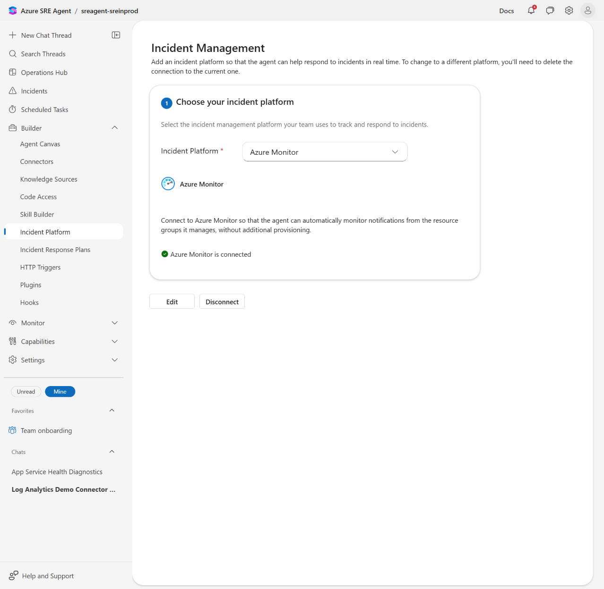

| Surface | Reads |
| --- | --- |
| Platform card status | **`✅ Azure Monitor is connected`** |
| Card actions | **`Edit`** *(re-opens the wizard)*, **`Disconnect`** *(prompts to confirm, then drops every response plan)* |

> ℹ️ **Disconnect is destructive.** Disconnecting Azure Monitor here also deletes every response plan you have configured. Treat the Incident Platform as a deploy-time decision, not a daily lever.

### Step 3: Confirm the Quickstart-created plan

> **Action:** Click **`Incident Response Plans`** in the left rail again.

The empty state is gone; one row is present:

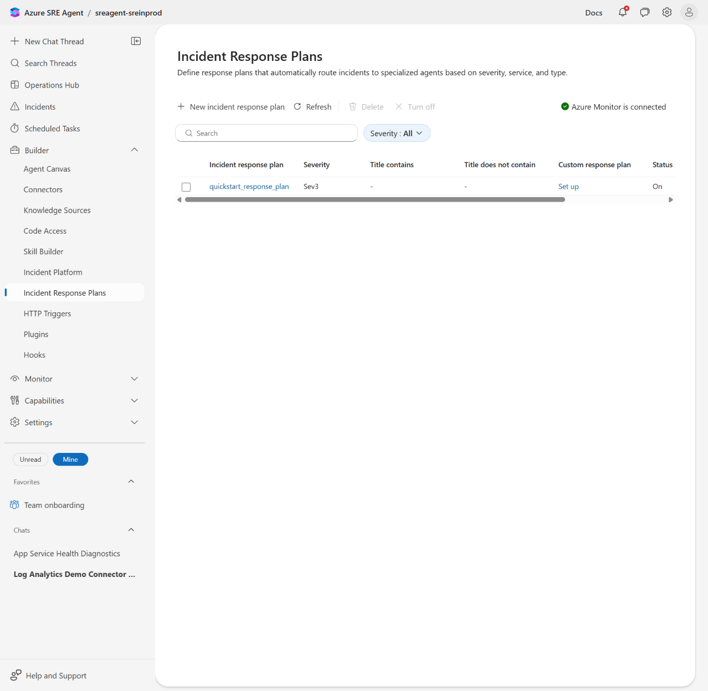

| Column | Value |
| --- | --- |
| **Incident response plan** | `quickstart_response_plan` *(blue link, clickable)* |
| **Severity** | `Sev3` |
| **Title contains** | `-` |
| **Title does not contain** | `-` |
| **Custom response plan** | **`Set up`** *(blue link - means "no custom plan yet, click to add one")* |
| **Status** | `On` |
| **Autonomy level** | `Review` *(visible by horizontal scroll)* |

Top-right of the page also surfaces **`✅ Azure Monitor is connected`** as a persistent status pill.

> 🔬 **Sev3, why?** The Quickstart toggle hardcodes Sev3. Sev3 in Azure Monitor is "warning" - not a paging event. We picked it as the workshop-safe default so a Quickstart plan cannot accidentally action a Sev0/Sev1 outage. To change it, click the plan and edit the **`Severity`** field on the wizard's Step 1.

### Step 4: Convert the Quickstart plan to a custom plan

> **Action:** Click the **`quickstart_response_plan`** link.

The plan editor opens with the header **"Edit incident response plan"**. By default it is a **3-step** wizard:

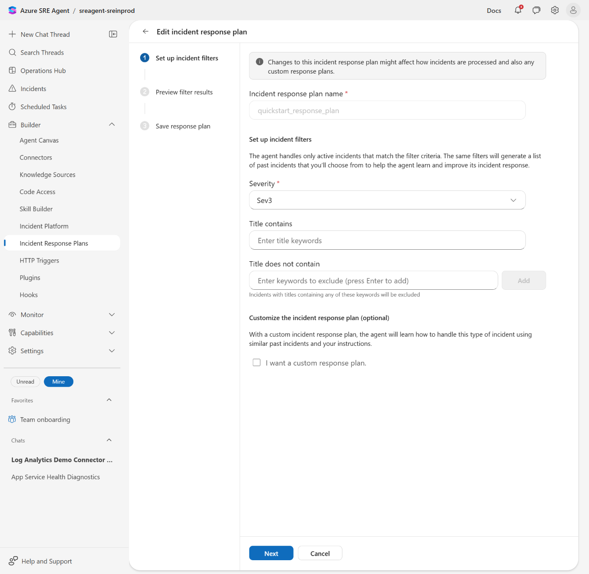

| Step | Label |
| --- | --- |
| 1 | **Set up incident filters** *(active)* |
| 2 | **Preview filter results** |
| 3 | **Save response plan** |

Visible on Step 1:

| Field | Value / behavior |
| --- | --- |
| Info banner | *"Changes to this incident response plan might affect how incidents are processed and also any custom response plans."* |
| **`Incident response plan name *`** | `quickstart_response_plan` *(disabled, immutable for the Quickstart plan)* |
| **`Severity *`** | `Sev3` *(editable - Sev0..Sev4 + Unspecified)* |
| **`Title contains`** | empty *(comma-list keyword filter)* |
| **`Title does not contain`** | empty *(exclusion keyword filter)* |
| Section header | **"Customize the incident response plan (optional)"** |
| Helper | *"With a custom incident response plan, the agent will learn how to handle this type of incident using similar past incidents and your instructions."* |
| **`☐ I want a custom response plan.`** | unchecked |

> **Action:** Tick the **`I want a custom response plan.`** checkbox.

The step list rebuilds into **4 steps**:


| Step | Label *(after checkbox)* |
| --- | --- |
| 1 | **Set up incident filters** |
| 2 | **Define agent learning** *(was "Preview filter results")* |
| 3 | **Review custom plan** *(new)* |
| 4 | **Save response plan** |

> **Action:** Click **`Next`**.

### Step 5: Type the workshop instructions

The wizard advances to **Step 2: Define agent learning**:

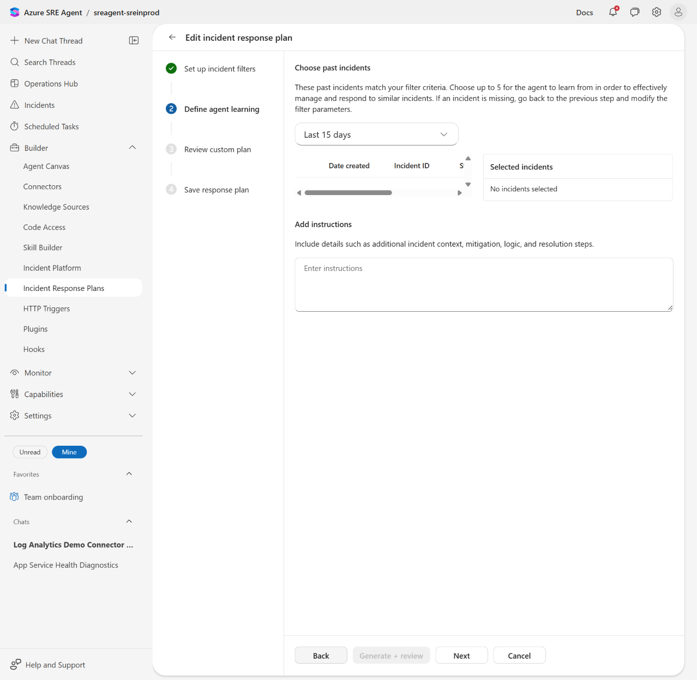

| Section | Notes |
| --- | --- |
| **`Choose past incidents`** | *"These past incidents match your filter criteria. Choose up to 5 for the agent to learn from in order to effectively manage and respond to similar incidents."* Default range: **`Last 15 days`**. For a fresh demo subscription this list is empty - skip it. |
| **`Selected incidents`** | Right-hand panel reads *"No incidents selected"*. |
| **`Add instructions`** | *"Include details such as additional incident context, mitigation, logic, and resolution steps."* Free-text **`Enter instructions`** textarea. |
| Toolbar buttons | **`Back`**, **`Generate + review`** *(disabled until instructions are typed)*, **`Next`**, **`Cancel`**. |

> **Action:** Paste the workshop response plan **verbatim** into the **`Enter instructions`** textarea:

```text
When an Http5xx alert fires for app-sreinprod-demo:
1. Pull the last 30 minutes of AppServiceHTTPLogs from the
   log-analytics-demo connector and identify the top failing routes by
   status code.
2. Cross-check exceptions and dependency failures from the
   app-insights-demo connector for the same window. Note any matching
   operation_Id values.
3. List the 3 most recent deployments to both production and staging
   slots.
4. Propose the least disruptive remediation first (slot swap back, app
   setting revert, scale out). Do not execute it.
5. Post a stakeholder-ready summary including: incident ID, suspected
   cause, evidence (with KQL snippets), proposed action, and rollback
   plan.
6. Wait for human approval before any write action. If approval is not
   received within 30 minutes, escalate to the on-call rotation.
```

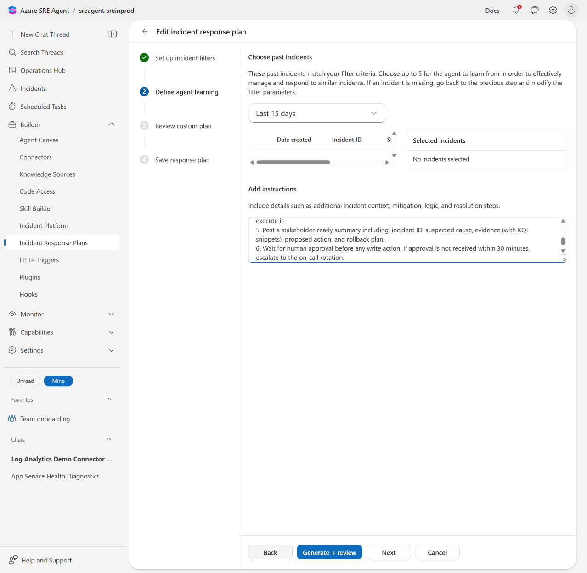

> **Action:** Once **`Generate + review`** activates, click it. The wizard advances to **Step 3: Review custom plan**.

### Step 6: Review the generated `EXECUTION_PLAN`

The Review step has two tabs near the top: **`Review custom incident response plan`** *(active)* and **`Test the response plan`**.

The header copy reads:

> *"This response plan was generated from the selected incidents and instructions. It includes suggested tools for the agent to use when handling incidents, which can be changed in the next step. Review and edit the response plan as needed."*

Below sits an **editable** code block titled `### EXECUTION_PLAN ###`. The first lines for our prompt:

```text
### EXECUTION_PLAN ###

**Guidelines:**
- This is an HTTP 5xx alert investigation for app-sreinprod-demo
- Perform diagnostics and analysis WITHOUT executing any mitigation actions
- Gather evidence and propose remediation options to stakeholders
- Require explicit human approval before any write operations
- Escalate if approval not received within 30 minutes

**Investigation and Diagnosis Steps:**
1. Retrieve and analyze AppServiceHTTPLogs from the past 30 minutes:
...
```

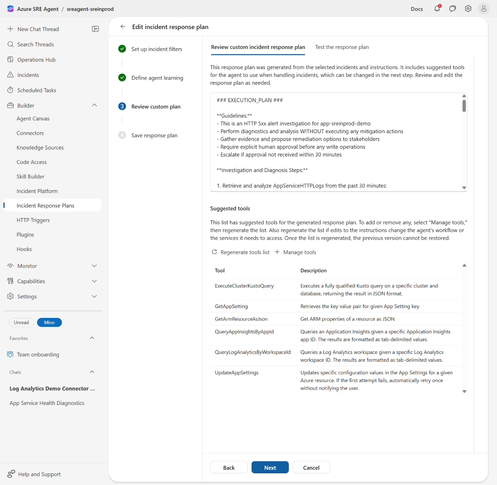

> 💡 **`EXECUTION_PLAN` vs your instructions.** The generated plan is a **structured rewrite** of your prose. The same six steps you typed are restated as `**Guidelines:**` plus enumerated `**Investigation and Diagnosis Steps:**`, and the per-step commands the agent intends to issue are spelled out (e.g. *"Retrieve and analyze AppServiceHTTPLogs from the past 30 minutes"*). This is what the agent will read into context when the plan fires - edit this block, not your original prompt, if you need a tighter contract.

Below the code block sits the section **`Suggested tools`**:

> *"This list has suggested tools for the generated response plan. To add or remove any, select \"Manage tools,\" then regenerate the list. Also regenerate the list if edits to the instructions change the agent's workflow or the services it needs to access. Once the list is regenerated, the previous version cannot be restored."*

Toolbar buttons: **`↻ Regenerate tools list`** and **`+ Manage tools`**.

For our prompt the **Suggested tools** table contains roughly these rows (your exact set may vary across portal versions):

| Tool | Description excerpt | Mutating? |
| --- | --- | --- |
| `ExecuteClusterKustoQuery` | *"Executes a fully qualified Kusto query on a specific cluster and database, returning the result in JSON format."* | No |
| `GetAppSetting` | *"Retrieves the key value pair for given App Setting key"* | No |
| `GetArmResourceAsJson` | *"Get ARM properties of a resource as JSON"* | No |
| `QueryAppInsightsByAppId` | *"Queries an Application Insights given a specific Application Insights app ID."* | No |
| `QueryLogAnalyticsByWorkspaceId` | *"Queries a Log Analytics workspace given a specific Log Analytics workspace ID."* | No |
| **`UpdateAppSettings`** | *"Updates specific configuration values in the App Settings for a given Azure resource. **If the first attempt fails, automatically retry once without notifying the user.**"* | **Yes** ⚠️ |

> 🔬 **The contract gap.** Your instructions said *"Wait for human approval before any write action"* and the generated `EXECUTION_PLAN` says *"Require explicit human approval before any write operations"*. The **Suggested tools** list nonetheless includes **`UpdateAppSettings`** which - per its own description - **silently auto-retries on first failure**. **Plan prose is not a guardrail. The tool list is.** Step 7 is where we close that gap.

### Step 7: Use **Manage tools** to enforce the guardrail

> **Action:** Click **`+ Manage tools`**.

A modal **`Manage tools`** opens, with the full tool catalog alphabetical, a select-all checkbox, and a **`Search`** box at the top:

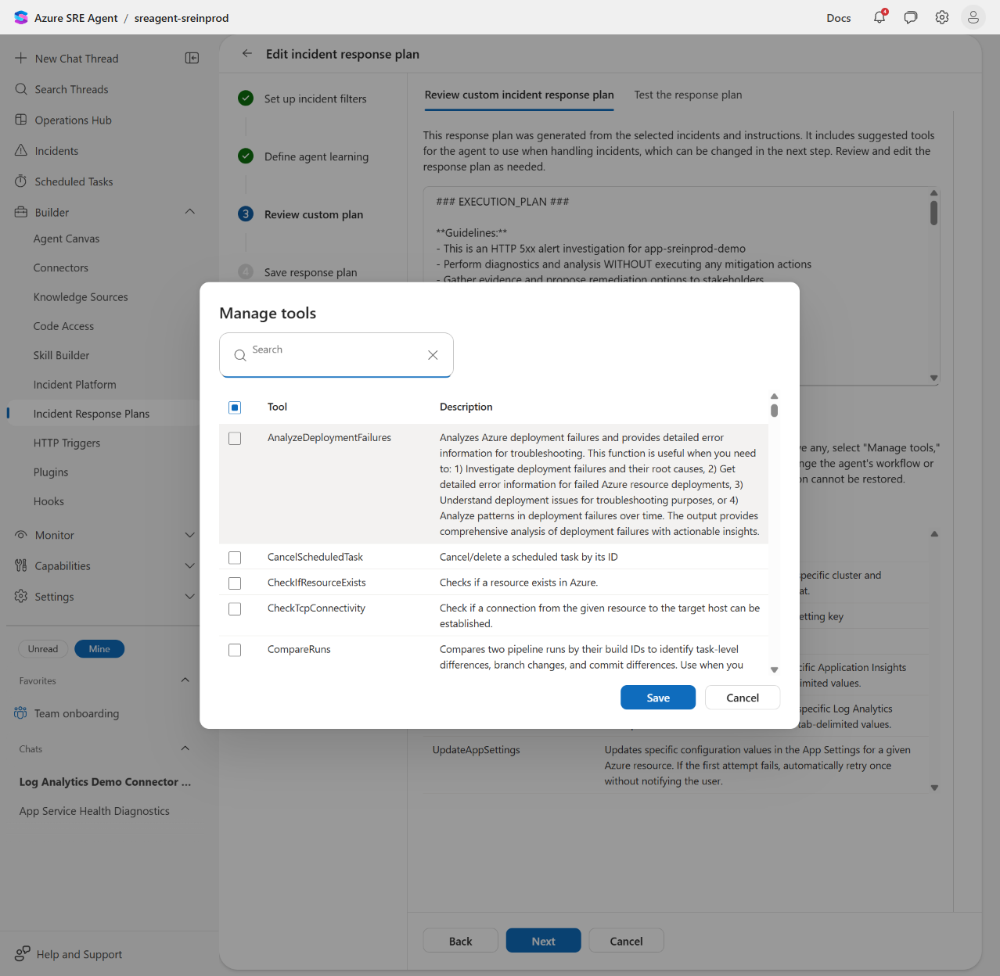

The first visible rows give a sense of the catalog breadth:

| Tool | Description excerpt |
| --- | --- |
| `AnalyzeDeploymentFailures` | *"Analyzes Azure deployment failures and provides detailed error information for troubleshooting..."* |
| `CancelScheduledTask` | *"Cancel/delete a scheduled task by its ID"* |
| `CheckIfResourceExists` | *"Checks if a resource exists in Azure."* |
| `CheckTcpConnectivity` | *"Check if a connection from the given resource to the target host can be established."* |
| `CompareRuns` | *"Compares two pipeline runs by their build IDs to identify task-level differences, branch changes, and commit differences."* |

> **Action:** Type **`update`** in the **`Search`** box.

The list filters - the search matches both **Tool** and **Description**. For our subscription it returns **one** mutating tool whose description contains *"update"* repeatedly:

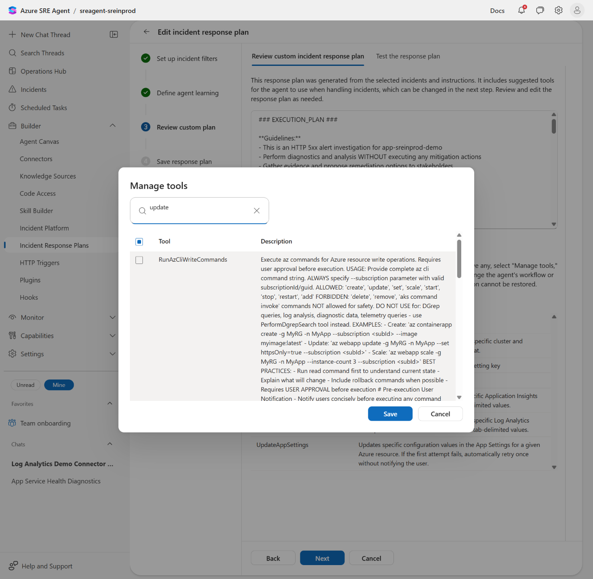

The full **`RunAzCliWriteCommands`** description is itself a hand-coded guardrail:

> *"Execute az commands for Azure resource write operations. **Requires user approval before execution.** USAGE: Provide complete az cli command string. ALWAYS specify --subscription parameter with valid subscriptionId/guid. **ALLOWED: 'create', 'update', 'set', 'scale', 'start', 'stop', 'restart', 'add' FORBIDDEN: 'delete', 'remove', 'aks command invoke' commands NOT allowed for safety.** DO NOT USE for: DGrep queries, log analysis, diagnostic data, telemetry queries - use PerformDgrepSearch tool instead. EXAMPLES: - Create: 'az containerapp create -g MyRG -n MyApp --subscription `<subId>` --image myimage:latest' - Update: 'az webapp update -g MyRG -n MyApp --set httpsOnly=true --subscription `<subId>`' - Scale: 'az webapp scale -g MyRG -n MyApp --instance-count 3 --subscription `<subId>`' **BEST PRACTICES: - Run read command first to understand current state - Explain what will change - Include rollback commands when possible - Requires USER APPROVAL before execution # Pre-execution User Notification - Notify users concisely before executing any command"***

> **Action:** For this workshop, **do not add** any mutating tool. The point of the plan is to *diagnose and propose*, not to *act*. Close the modal with **`Cancel`**.

> 🔒 **The structural pattern.** Tool descriptions encode policy ("Requires user approval", "FORBIDDEN: delete") in **prose** that the model must honor. The **structural** controls are: (a) what tools the plan can call at all (this picker), and (b) the autonomy level (Step 9). Always treat the picker as the source of truth - never rely on the EXECUTION_PLAN's prose alone to keep mutating tools idle. |

### Step 8: Peek at the **Test the response plan** tab

> **Action:** Click the **`Test the response plan`** tab next to *Review custom incident response plan*:

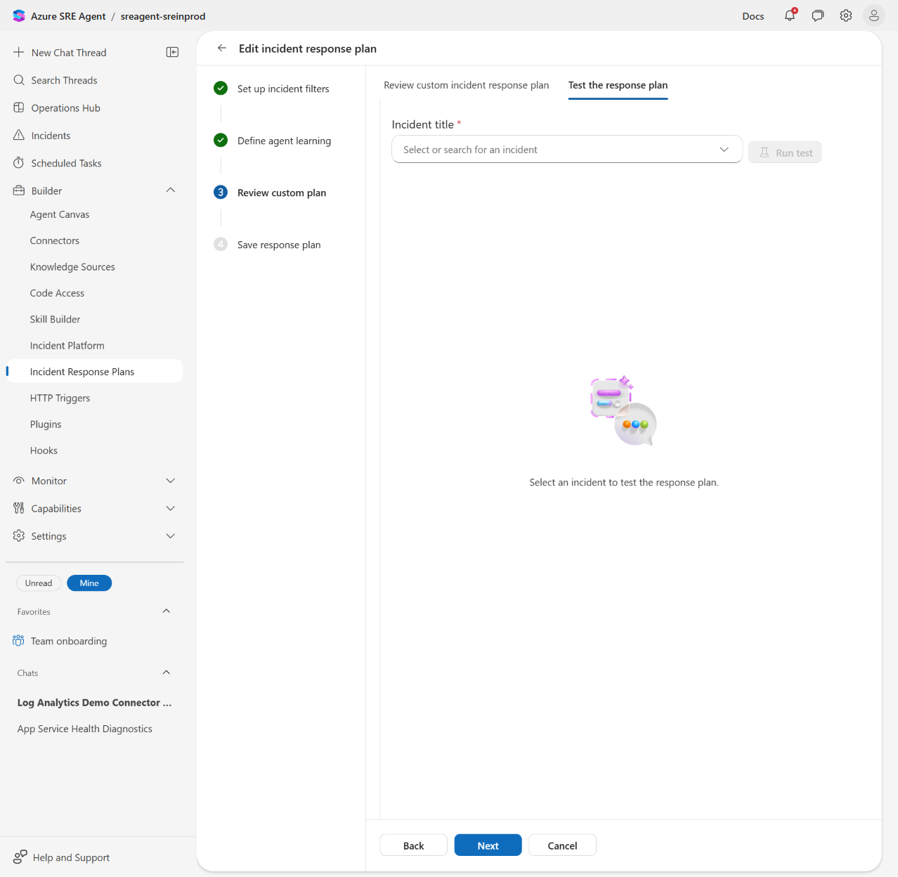

This is a dry-run surface: the agent processes the plan against a synthetic Sev3 incident so you can read the chain of tool calls without waiting for a real alert. It is empty until you trigger a test from this tab. For the workshop we skip it - we will trigger a real Http5xx burst in Module 6 instead.

> **Action:** Switch back to **`Review custom incident response plan`** and click **`Next`**.

### Step 9: Set the autonomy level and save

The wizard lands on **Step 4: Save response plan** - the **Guardrails surface**:

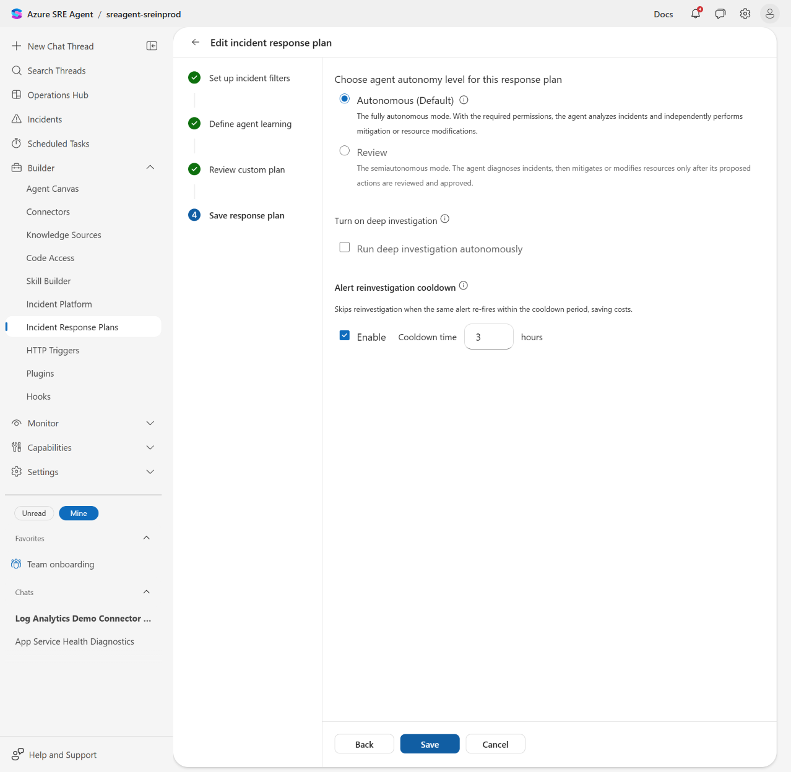

Three controls live on this step:

| Control | Default | What it means |
| --- | --- | --- |
| **Choose agent autonomy level for this response plan** - radio | **`Autonomous (Default)`** ⚠️ | *"The fully autonomous mode. With the required permissions, the agent analyzes incidents and independently performs mitigation or resource modifications."* The agent acts without waiting. |
| Same radio, second option | `Review` | *"The semiautonomous mode. The agent diagnoses incidents, then mitigates or modifies resources only after its proposed actions are reviewed and approved."* The agent posts findings + a proposed action and waits. |
| **Turn on deep investigation** - **`☐ Run deep investigation autonomously`** | unchecked | When on, the agent runs a longer-form root-cause sweep on top of the plan. Costs more tokens. Leave off for the workshop. |
| **Alert reinvestigation cooldown** - **`☑ Enable`** + **`Cooldown time`** (number) hours | `Enable` on, `3 hours` | *"Skips reinvestigation when the same alert re-fires within the cooldown period, saving costs."* Prevents alert storms from re-running the plan back-to-back. |

> ⚠️ **The Quickstart trap.** Even though the Quickstart-created row reads **Autonomy: Review** on the table, opening the plan and ticking **`I want a custom response plan.`** resets the radio on this step to **`Autonomous (Default)`**. **Always re-select `Review` before saving** unless you have done the work to make the plan idempotent and the tools have explicit rollback paths.

> **Action:** Click the **`Review`** radio. Leave the cooldown at **3 hours**. Click **`Save`**.

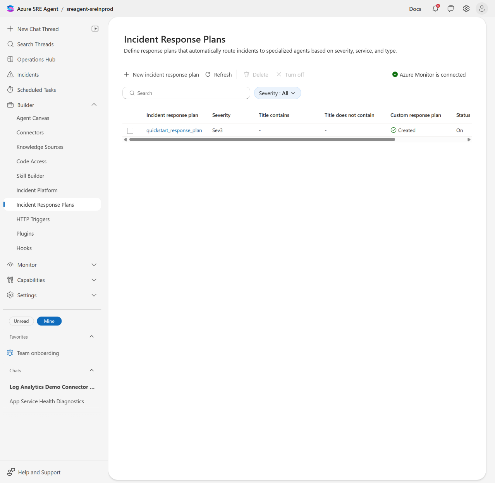

The page returns to **Incident Response Plans** with the row updated:

| Column | Before save | After save |
| --- | --- | --- |
| **Custom response plan** | **`Set up`** *(link)* | **`✅ Created`** *(status pill, hover for "Setup complete")* |
| **Status** | `On` | `On` |
| **Autonomy level** | `Review` | `Review` *(now bound to your custom plan's Step 4 radio, not the Quickstart default)* |

The plan is live. The next time Azure Monitor raises a Sev3 incident on a resource group the agent manages, the agent will read the `EXECUTION_PLAN`, run the read-only tools, post a summary, and wait for a human approval before any write tool fires.

> 🐞 **Custom-plan checkbox stickiness.** Re-opening the saved plan after this point keeps the **`I want a custom response plan.`** checkbox ticked. Unchecking it does **not** delete the `EXECUTION_PLAN` you wrote; it only collapses the wizard back to 3 steps so you can edit the filters in isolation. Re-tick it to reach the Review/Save steps again.

## Discussion prompts

- The Quickstart toggle is **on by default** and explicitly warns *"autonomous response plan that begins processing incidents immediately"*. **What should ship in your golden image: Quickstart on with `Review` autonomy, Quickstart on with `Autonomous` autonomy, or Quickstart off entirely?** *(Hints: blast radius vs onboarding friction, change-control gates, whether the agent's identity already has only `Reader` everywhere.)*
- Tool descriptions encode policy in prose (*"FORBIDDEN: 'delete', 'remove'"*, *"Requires user approval"*). **Should you trust the description, or should you maintain your own allow-list at the `Manage tools` layer per response plan?** *(Hints: tool versioning, vendor changes, who owns the prose, audit trail of plan edits.)*
- The instructions you typed and the generated `EXECUTION_PLAN` both say *"Wait for human approval before any write action"*, yet the **Suggested tools** list still includes `UpdateAppSettings` which silently auto-retries. **Whose responsibility is it to reconcile the prose contract and the tool list?** *(Hints: platform team vs feature team, regression tests for plans, the Test the response plan tab as part of CI.)*
- A single plan binds one **Severity** to one **Autonomy level**. **Sketch the policy you would actually use for Sev0..Sev4 across `Review` vs `Autonomous`.** *(Hints: revenue-impacting Sev0 might be `Review` *for messaging* but `Autonomous` *for failover*, while Sev3 capacity warnings might be the opposite.)*
- **Module 4** gave you **`View trace`** for chat sessions. **Module 5** gives you **`Test the response plan`** for incident sessions. **What is missing for a fully reproducible post-incident review?** *(Hints: trace export, plan diff between fires, EXECUTION_PLAN versioning, who acknowledged the human-approval step.)*

## Validation checklist

- [ ] **Incident Platform** page reads **`✅ Azure Monitor is connected`** with **`Edit`** and **`Disconnect`** buttons.
- [ ] **Incident Response Plans** page lists `quickstart_response_plan` with **Severity = Sev3**, **Custom response plan = ✅ Created**, **Status = On**, **Autonomy level = Review**.
- [ ] Re-opening the plan keeps **`I want a custom response plan.`** ticked and the wizard at **4 steps**.
- [ ] The **`Review custom plan`** step shows your `### EXECUTION_PLAN ###` code block with **Guidelines** + **Investigation and Diagnosis Steps**, plus a **Suggested tools** table.
- [ ] **Manage tools** search for `update` returns `RunAzCliWriteCommands` and its description literally contains *"FORBIDDEN: 'delete', 'remove'"* and *"Requires USER APPROVAL before execution"*.
- [ ] **Save response plan** step's **`Choose agent autonomy level`** radio is set to **`Review`** (not the default `Autonomous`).
- [ ] **Alert reinvestigation cooldown** is **Enabled** at `3 hours`.
- [ ] The agent's managed identity still holds at minimum **`Reader`** on `rg-sreinprod-demo` (Module 4 prerequisite) so Azure Monitor incidents from that RG can reach the agent.

## Reference: full screenshot index

Captured against the live portal in June 2026. Files live under `images/wizard/` so facilitators can reuse them in slides.

| # | Screen | File |
| --- | --- | --- |
| 37 | Incident Response Plans, empty state, `+ New` disabled ⭐ embedded | [37-response-plans-page.png](../images/wizard/37-response-plans-page.png) |
| 38 | Incident Management Step 1, empty platform dropdown ⭐ embedded | [38-incident-platform-catalog.png](../images/wizard/38-incident-platform-catalog.png) |
| 39 | Platform dropdown open: PagerDuty / ServiceNow / Azure Monitor ⭐ embedded | [39-platform-dropdown.png](../images/wizard/39-platform-dropdown.png) |
| 40 | Azure Monitor selected, platform description visible ⭐ embedded | [40-azure-monitor-selected.png](../images/wizard/40-azure-monitor-selected.png) |
| 41 | Quickstart toggle ON, autonomous warning banner ⭐ embedded | [41-quickstart-toggle-on.png](../images/wizard/41-quickstart-toggle-on.png) |
| 42 | Connecting state ⭐ embedded | [42-platform-connected.png](../images/wizard/42-platform-connected.png) |
| 43 | Azure Monitor connected, Edit / Disconnect ⭐ embedded | [43-azure-monitor-connected.png](../images/wizard/43-azure-monitor-connected.png) |
| 44 | Incident Response Plans, quickstart_response_plan row ⭐ embedded | [44-response-plans-with-default.png](../images/wizard/44-response-plans-with-default.png) |
| 45 | Edit plan, 3-step wizard, custom checkbox unchecked ⭐ embedded | [45-quickstart-plan-detail.png](../images/wizard/45-quickstart-plan-detail.png) |
| 46 | Custom plan checked, wizard now has 4 steps ⭐ embedded | [46-custom-plan-fields.png](../images/wizard/46-custom-plan-fields.png) |
| 47 | Define agent learning, empty past incidents + instructions textarea ⭐ embedded | [47-define-agent-learning.png](../images/wizard/47-define-agent-learning.png) |
| 48 | Workshop instructions typed into the textarea ⭐ embedded | [48-instructions-typed.png](../images/wizard/48-instructions-typed.png) |
| 49 | Review custom plan: EXECUTION_PLAN + Suggested tools ⭐ embedded | [49-review-custom-plan.png](../images/wizard/49-review-custom-plan.png) |
| 50 | Manage tools modal, full alphabetical catalog ⭐ embedded | [50-manage-tools.png](../images/wizard/50-manage-tools.png) |
| 51 | Manage tools filtered to "update", RunAzCliWriteCommands ⭐ embedded | [51-manage-tools-update-filter.png](../images/wizard/51-manage-tools-update-filter.png) |
| 52 | Test the response plan tab, empty ⭐ embedded | [52-test-tab.png](../images/wizard/52-test-tab.png) |
| 53 | Save response plan: Autonomous default + cooldown ⭐ embedded | [53-save-step.png](../images/wizard/53-save-step.png) |
| 54 | Same step with **Review** selected | [54-review-mode-selected.png](../images/wizard/54-review-mode-selected.png) |
| 55 | Plan saved: row reads Created / On / Review ⭐ embedded | [55-saved-plan-list.png](../images/wizard/55-saved-plan-list.png) |

## Further reading

- [Incident response plans in Azure SRE Agent](https://go.microsoft.com/fwlink/?linkid=2341945): the official guide to plan structure, supported severities, and platform connectors.
- [Module 4: Connect Observability](./4-Connect-Observability.md) wired the two telemetry connectors this plan reads from (`log-analytics-demo`, `app-insights-demo`).
- [Module 6: Incident Drill](./6-Incident-Drill.md) injects a real Http5xx burst to make the Sev3 plan fire end-to-end.

## Notes for repo owners

Re-capture screenshots `37` to `55` if any of the following ships:

- The **Incident Platform** catalog gains or renames providers (today: `PagerDuty`, `ServiceNow`, `Azure Monitor`).
- The Quickstart toggle changes its **default severity** off `Sev3`, or its **autonomous** warning wording is updated.
- The plan wizard renames steps (today: `Set up incident filters`, `Define agent learning`, `Review custom plan`, `Save response plan`) or collapses the 3-step / 4-step branch into a single step.
- The **`Manage tools`** picker is restructured (e.g. categorised, paginated) or `RunAzCliWriteCommands` ships a different `FORBIDDEN` list - the workshop's *"the description is a guardrail"* lesson hinges on the current wording.
- The autonomy radio gains a third option (e.g. a `Suggest` middle ground) or the **`Alert reinvestigation cooldown`** default changes from 3 hours.

The brittlest screenshots in the set are **49** (the generated EXECUTION_PLAN is model-dependent and will drift), **50/51** (the tool catalog grows over time), and **53** (the autonomy radio default and the cooldown default are both product-team choices that can change without notice).
