# Module 6 - Incident Drill

[← Module 5: Response Plans and Guardrails](./5-Response-Plans-and-Guardrails.md) | [Workshop home](./ReadMe.md) | [Next: Module 7 →](./7-Production-Rollout.md)

## Objective

Stand up a real production incident on the demo workload and watch every guardrail you wired in Modules 3 to 5 fire end-to-end. By the end of this module the participants will have:

1. **Baselined** the agent's three operator surfaces (`Operations Hub`, `Incidents`, chat) so they can tell a healthy posture from an active one.
2. **Injected** a config-change fault that drives an HTTP 500 burst on the production slot and produced the resulting **Application Insights** + **Http5xx metric alert** signals.
3. Watched the **Sev3 Failure Anomalies** smart detector flow through the **Module 5 `quickstart_response_plan`** and land in the **Incidents** inbox with `Agent status = Completed` (the autonomous side of the contract).
4. Driven a **chat-side investigation** from a single natural-language prompt and read the full **Timeline → Root Cause → Code quote → Recommended Mitigation** chain the agent produces, including the **`View trace`** breakdown of every model call and tool call (the *Review*-autonomy side of the contract).
5. Decided on remediation **under explicit human approval**, exactly as Module 5's `Review` autonomy radio promised.

> Time: ~45 min (5 min framing, 30 min hands-on, 10 min discussion).
> Prereq: Modules 3 (connectors), 4 (telemetry), and 5 (response plan saved as `Created / On / Review` against `Sev3`) are complete. The demo app deployed by `scripts/deploy-demo-env.ps1` is healthy. `scripts/env.conf` is populated.

## Scenario

The sample app ([`Azure-Samples/app-service-dotnet-agent-tutorial`](https://github.com/Azure-Samples/app-service-dotnet-agent-tutorial)) ships a deliberately fragile route at `Program.cs:11`:

```csharp
bool injectError = Environment.GetEnvironmentVariable("INJECT_ERROR") == "1";
// ...
if (injectError && !safeMode && buttonPressed && pressCount > 5)
    throw new Exception("Simulated error after 5 button clicks!");
```

The drill flips `INJECT_ERROR=1` on the **production slot** of `app-sreinprod-demo-<suffix>`, then drives `?crash=1` requests in 3 cookie sessions until the 6th click trips the throw on each session. The **resulting signal looks identical to a real bad config change reaching production**: a clean Http5xx spike, an exception with a non-trivial stack, and a recent **`Microsoft.Web/sites/config/write`** activity-log entry attributable to a real principal.

## What this module adds (and what it does not)

| Aspect | What it is | What it is not |
| --- | --- | --- |
| **Two alert paths firing in parallel** | (a) The **Bicep-deployed metric alert** `alert-sreinprod-demo-http5xx` (severity **Sev2**, threshold `Http5xx >= 5` over PT5M), and (b) the **Application Insights smart detector** **`Failure Anomalies - appi-sreinprod-demo-<suffix>`** (severity **Sev3**, fires on statistical anomaly in exception rate). Both fire from the same fault burst, within ~30s of each other. | A single inbox. The Sev3 path goes through the **Module 5 response plan** because the plan filter is `Severity = Sev3`. The Sev2 metric alert raises but does **not** trigger autonomous handling - it is a paging signal for humans. |
| **Autonomous + interactive paths sharing one root cause** | The agent runs the **response plan** end-to-end on the Sev3 incident (autonomous, posts the diagnosis under `Agent status = Completed`) **while** a human can simultaneously open chat and ask the same question, getting a richer narrative + remediation prompt under the `Review` autonomy radio. | A duplicate. The two paths read the **same** AppInsights + ActivityLog + connectors, so the evidence is consistent. The chat path adds source-code reads (the GitHub Code connector from Module 3) that the response plan's allow-listed tool set may not include. |
| **`View trace`** | A first-class debugging surface that exposes, for every chat reply, the **model used** (`claude-opus-4-6` in the current build), every **`Reasoning`** span, every **`Tool`** call (`RunAzCliReadCommands`, `monitor-client_monitor_resource_log_query`, `SearchIncidentKnowledge`, `ManageTodoList`), and the order they ran in. Available from the `View trace` button on each agent reply. | A log of human approvals. Approvals on `Review`-autonomy plans live in chat. The trace shows what the agent *intended*, not what humans accepted or rejected. Capture chat as part of the post-incident review, not just the trace. |
| **`Operations Hub` `Daily Volume by Source`** chart | Aggregates **Conversations**, **Incidents**, and **Scheduled Tasks** counts per day across all surfaces, including incidents that fired against an active response plan. Drillable by clicking the legend. | Real-time. The chart updates on a multi-minute cadence; rely on the Incidents page, the chat thread itself, or `az monitor metrics list` for second-level resolution. |

## Lab steps

> All lab steps assume the agent at `https://sre.azure.com/agents/subscriptions/<subId>/resourceGroups/rg-sreinprod-agent/providers/Microsoft.App/agents/sreagent-sreinprod` and the demo app under `rg-sreinprod-demo`. **Always confirm `scripts/env.conf` is populated before running any of the helper scripts** (otherwise they error out with *"APP_NAME is required"*).

### Step 1: Baseline the operator surfaces

Before flipping anything, capture what "healthy" looks like for the three places an operator will check during the incident. Doing this *before* the burst makes the post-burst delta obvious to participants.

**1a. Open the agent's `Operations Hub`.** The page header reads *"View key metrics, insights, and incident analytics for your agent at a glance."* Three tiles matter:

| Surface | Healthy reading |
| --- | --- |
| **All sources configured** banner | Every connector pill is ✅: `Code`, `Logs`, `Incidents`, `Azure resources`, `Knowledge files`. (This is the post-Module-4 baseline.) |
| **System Health** card | **Agent Process** = ✅ **Healthy** and **Connectors Overview** = ✅ **4 Healthy** (Active Connectors: 4 - all from Module 3). |
| **Daily Volume by Source** chart | Should be flat or near-flat for the current day. Any bar already on today is leftover from a previous run; refresh and re-baseline. |

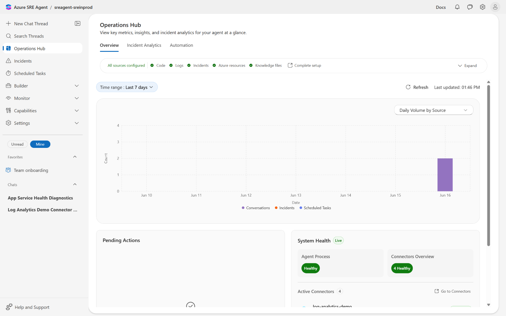

**1b. Open the agent's `Incidents` page** (`Incidents` in the left rail). Header: *"View and manage incidents across connected platforms. The agent assists with real-time incident response."*

| Surface | Healthy reading |
| --- | --- |
| **Alert status** counters | `New = 0`, `Acknowledged = 0`. |
| **Agent status** counters | `Pending user input = 0`, `In progress = 0`, `Completed = 0`. |
| **Alert title** table | *"No incidents found"* empty-state. |

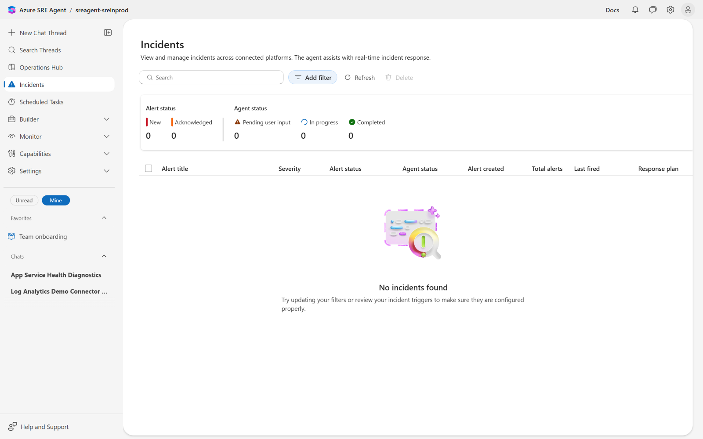

**1c. Open the agent's chat home** (sidebar `New Chat Thread`, then close out without sending). The home banner reads **"All sources configured"** with the same 5 ✅ pills as the Operations Hub, plus the prompt entry *"Ask a question or enter a slash(/) to use a command"*.

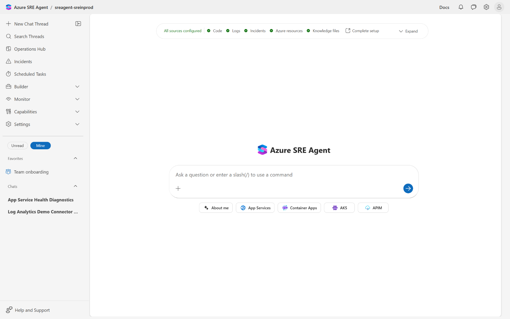

> 💡 **Why baseline first.** The agent's `Operations Hub` and `Incidents` page **only show deltas** against what they last saw. If you skip the baseline, participants will see a populated chart 5 minutes later and assume "the agent did something" rather than "the agent reacted to a real signal you can correlate".

### Step 2: Inject the fault

From the workshop root run:

```powershell
pwsh ./scripts/demo-warmup.ps1
```

The script does four things, all attributed to the operator running it (so the Activity Log will show **your** UPN, which is what the agent will key off in Step 6):

| Step | Command | Why |
| --- | --- | --- |
| 1/4 | `az webapp config appsettings set --settings INJECT_ERROR=0` | Resets the production slot to a known-good baseline. Without this, a previous run's fault state contaminates the new burst. |
| 2/4 | 25× `Invoke-WebRequest https://<APP_URL>` | Generates **healthy 200s** for ~6s. This populates `AppServiceHTTPLogs` so the agent's Module 4 KQL has a "before" picture, not just a wall of 5xx. |
| 3/4 | `az webapp config appsettings set --settings INJECT_ERROR=1` | The fault. Two `Microsoft.Web/sites/config/write` operations land in the Activity Log under your UPN. **This is the smoking-gun event the agent will surface in its Timeline section.** |
| 4/4 | 3 sessions × 30 `?crash=1` requests | The sample app increments a `crashCount` cookie per session and throws the `Simulated error after 5 button clicks!` exception on click 6. With 3 cookie jars and 30 requests each you get ~25 healthy + ~25 5xx (the first 5 of each session succeed, the next 25 fail). |

Expected console output:

```text
Step 1/4: Resetting production slot to baseline (INJECT_ERROR=0)...
Step 2/4: Generating 25 baseline requests against https://app-sreinprod-demo-<suffix>.azurewebsites.net ...
Step 3/4: Injecting fault (INJECT_ERROR=1)...
Step 4/4: Driving 30 failing requests across 3 sessions ...
  session 1 complete
  session 2 complete
  session 3 complete

Warmup complete. Give Application Insights and the Http5xx metric alert about 3-5 minutes to surface telemetry, then ask the SRE Agent to investigate.
```

> ⚠️ **App Service restart timing.** Setting `INJECT_ERROR=1` triggers an App Service worker restart. The script's built-in `Start-Sleep -Seconds 10` between **3/4** and **4/4** is **deliberately tight** to keep the demo crisp, but on cold workers the restart can take longer than 10s, in which case the burst lands on the *old* process and you will see 200s instead of 500s. **Verify with `az monitor metrics list` (next callout). If `Http5xx` shows `0`, re-run only `4/4` (3 more sessions of 30 requests each) after another minute.**

To confirm 5xx are actually flowing on the production slot, ask Azure Monitor directly:

```powershell
az monitor metrics list `
  --resource (az webapp show -g $env:APP_RESOURCE_GROUP -n $env:APP_NAME --query id -o tsv) `
  --metric Http5xx --aggregation Total --interval PT1M --output table
```

A successful burst shows a row with `Total` between **40** and **60** for the minute the fault burst ran. If `Total = 0` for every row in the last 10 minutes, the App Setting did not propagate before the burst. Re-drive sessions until `Total >= 5` (the alert's threshold).

If you do not see any `Total` values above 0 for the last 10 minutes, you can alternatively open the app on your browser by visiting `https://<APP_URL>` and clicking the **Increment"** button 6 times. The app will throw the exception and you will see a 500 response in your browser. Repeat the process multiple times to generate a burst of 5xx responses. The agent will pick up the spike in exceptions and the metric alert will fire.

### Step 3: Wait for ingestion and let the alerts fire

App Insights ingestion latency is **2-5 minutes** for exceptions; the metric alert evaluates every **PT1M** against a **PT5M** rolling window. Set a 5-minute timer.

Two alerts will fire from the same burst:

| Alert | Source | Severity | Fires when | Module 5 plan reaction |
| --- | --- | --- | --- | --- |
| **`alert-sreinprod-demo-http5xx`** | Bicep metric alert from `infra/main.bicep` | **Sev2** | `count(Http5xx) over PT5M >= 5`, evaluated PT1M | **No autonomous reaction.** The plan filter is `Severity = Sev3`. The alert raises and is visible in `Azure Monitor`, but the response plan does not pick it up. |
| **`Failure Anomalies - appi-sreinprod-demo-<suffix>`** | App Insights smart detector (auto-enabled per App Insights resource) | **Sev3** | Statistical anomaly in failed-request rate | **Plan fires.** Matches `Severity = Sev3`. The agent runs the `EXECUTION_PLAN` end-to-end, posts the result, marks the incident `Acknowledged / Completed`. |

> 🔬 **Why two paths is the point.** Module 5 told you that *"the response plan's filter is the structural guardrail"*. This drill proves it: the metric alert (which a human is paged for) and the smart detector (which the agent triages) reach the operator at roughly the same moment, but only the **Sev3** one matches the plan. **Whoever owns the alert catalog decides what the agent autonomously touches.** Promote `alert-sreinprod-demo-http5xx` to Sev3 (or relax the plan filter to include Sev2) only after you have done the work to validate the response plan's tool list against Sev2 blast radius.

### Step 4: Confirm the autonomous path - the Incidents inbox

Open **Incidents** in the agent's left rail. The empty state from Step 1 is gone:

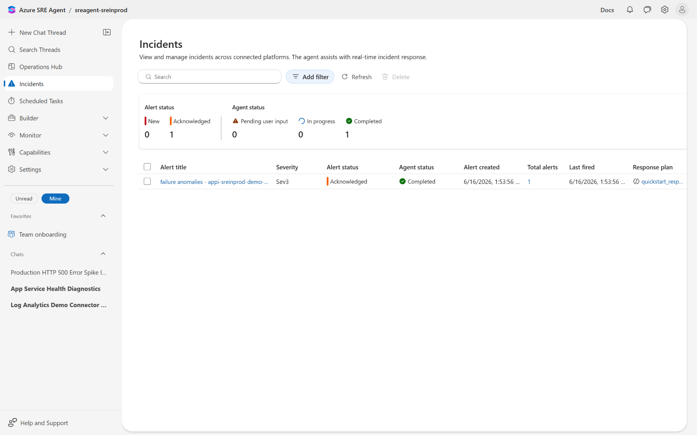

| Surface | Reads |
| --- | --- |
| **Alert status** counters | `New = 0`, **`Acknowledged = 1`** |
| **Agent status** counters | `Pending user input = 0`, `In progress = 0`, **`Completed = 1`** |
| **Alert title** | `failure anomalies - appi-sreinprod-demo-<suffix>` *(blue link to the Azure Monitor alert detail)* |
| **Severity** | `Sev3` |
| **Alert status** column | `Acknowledged` *(the agent acknowledged it on intake)* |
| **Agent status** column | ✅ `Completed` *(the response plan finished the read-only investigation and posted its summary)* |
| **Alert created** / **Last fired** | matching timestamps from your burst |
| **Total alerts** | `1` |
| **Response plan** | `quickstart_response_plan` *(blue link, opens the Module 5 plan)* |

> 🔒 **The autonomous contract proven.** The row reads `Acknowledged / Completed` because Module 5's plan was saved with **Autonomy = Review** but the **read-only steps** of the `EXECUTION_PLAN` (gather logs, query AppInsights, list deployments, write a summary) are **not** mutating, so they ran without prompting. The plan only **stops** at the proposed write step. If you saved the plan as **Autonomous (Default)** instead, this row would still read `Completed` but the `INJECT_ERROR=0` rollback may have already executed - **always re-check the autonomy column before treating a `Completed` row as "investigation only".**

Click the alert title to open the agent's response-plan summary in chat. Treat its findings as **evidence collected by the autonomous path**; we will reproduce the same evidence chain interactively in the next steps for participants who joined late.

### Step 5: Open chat and submit the investigation prompt

In the left rail click **`+ New Chat Thread`**. The thread opens blank with the prompt entry at the bottom:

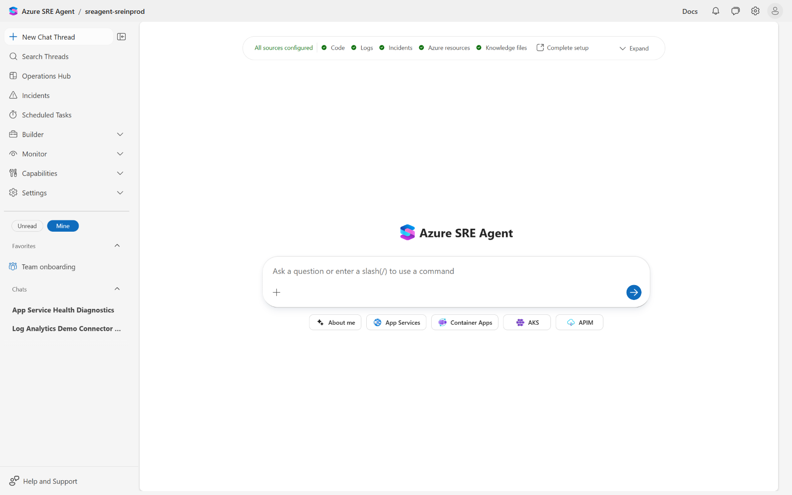

Paste the workshop prompt verbatim into the input. Use this exact wording so participant traces match the screenshots:

```text
We are seeing a spike of HTTP 500 errors on our production application.
Users started reporting issues in the last few minutes.
Can you investigate the cause of these 500 errors and identify the
likely root cause?
```

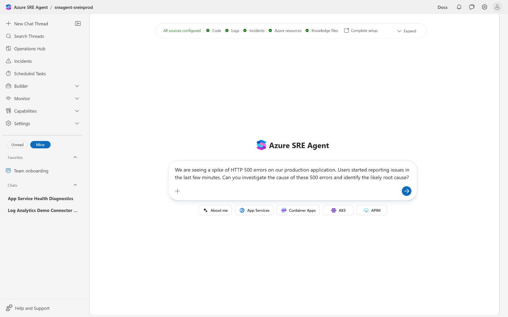

Press **`Ctrl+Enter`** (or click the round blue Send button). The chat thread is created with the title **`Production HTTP 500 Error Spike Investigation`** in the left rail and the agent's first reply appears within ~2s:

> *"I'll investigate the HTTP 500 errors immediately. Let me start by gathering context from multiple sources in parallel."*

A first **`Investigating HTTP 500 errors <1s`** reasoning chip is rendered above the reply.

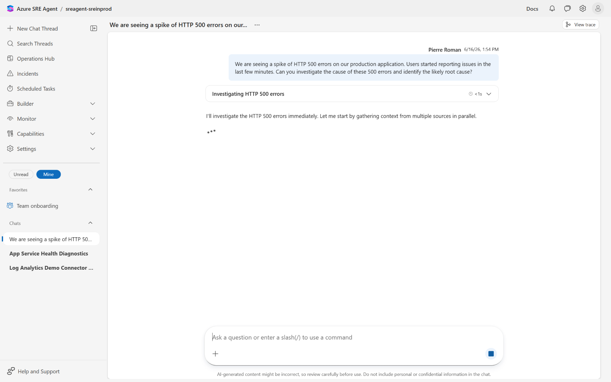

> 💡 **Why this prompt format.** The prompt does **not** name the resource group, the app, the alert, the connector, or the time window. The agent must figure those out from the **Module 3 connectors** (`code-source-1`, `app-insights-demo`, `log-analytics-demo`, `azure-resources`) plus the agent's **managed-resources scope** (set during onboarding to `rg-sreinprod-demo`). If the prompt over-specifies the answer, the demo proves nothing about the connector wiring.

### Step 6: Watch the agent gather evidence in parallel

Within ~10s the agent fans out across multiple tools simultaneously. Each tool call renders as a card in the chat with a status pill and an inline transcript when relevant.

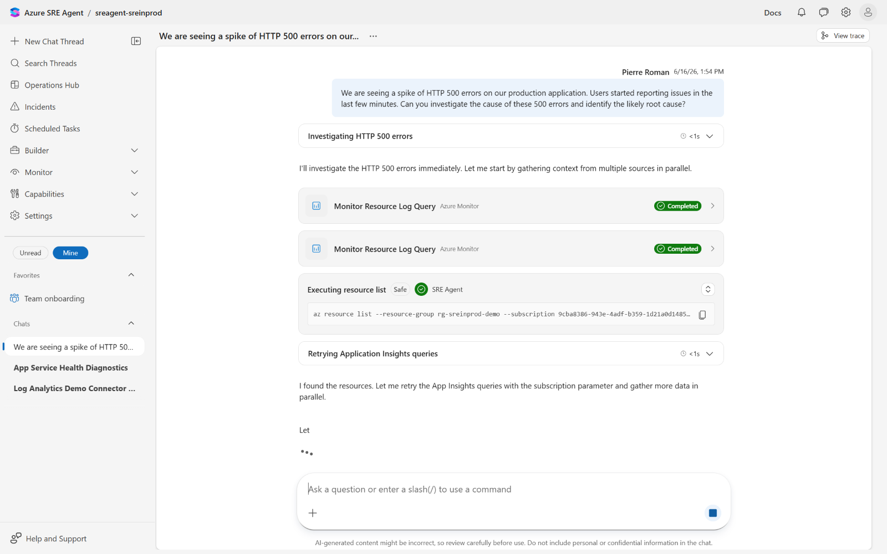

Tools you will see early in the chain:

| Tool card | Risk badge | What it actually does | Why it matters |
| --- | --- | --- | --- |
| `Monitor Resource Log Query` (`Azure Monitor`) | n/a *(read-only)* | Issues `AppServiceHTTPLogs` and `AppExceptions` KQL against the `log-analytics-demo` connector from Module 4. Returns `Completed` once the workspace responds. | **The Http5xx spike** the agent will quote in its Timeline comes from this query, not from the metric alert. |
| `Executing resource list` (`SRE Agent`) | **Safe** ✅ | Runs `az resource list --resource-group rg-sreinprod-demo --subscription <subId>`. Read-only ARM list. | **Bounds the blast radius.** The agent can only see resources in groups its identity has read on (Module 4 prereq). The `Safe` badge is computed from the tool's category, not from the command itself, so it auto-fires without prompting. |
| `Retrying Application Insights queries` *(reasoning chip, no tool card)* | n/a | The agent's first AppInsights query failed (subscription parameter missing). The chip narrates the fix: *"I found the resources. Let me retry the App Insights queries with the subscription parameter and gather more data in parallel."* | **The agent self-corrects.** Workshop participants should see this and understand that "tool failure" does not mean "investigation failure" - the agent learns the correct invocation and retries. |

A few seconds later more cards appear:

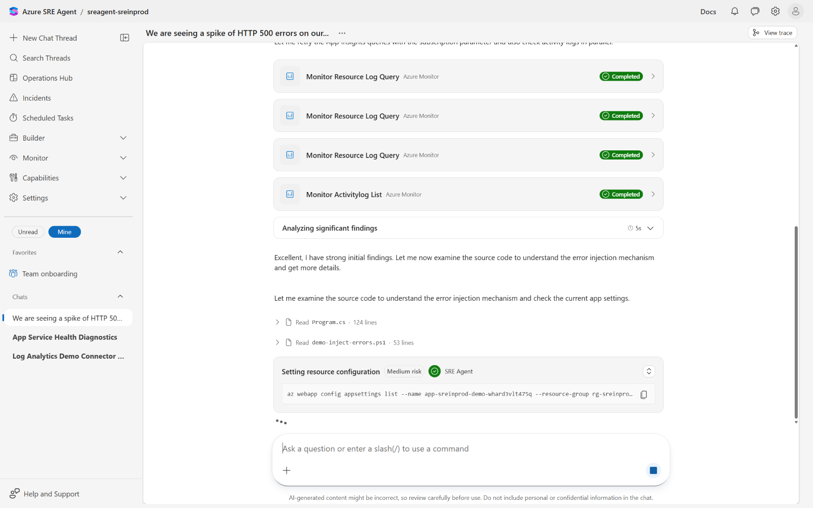

| Tool card | Risk badge | What it does | Why it matters |
| --- | --- | --- | --- |
| `Monitor Activitylog List` (`Azure Monitor`) | n/a | Lists subscription Activity Log over the past hour. | **Surfaces the Module 5 smoking gun**: the `Microsoft.Web/sites/config/write` operations attributed to the principal who ran `demo-warmup.ps1`. Without the Activity Log read, the agent can prove "errors are happening" but not "who changed what". |
| `Read Program.cs (124 lines)` (`Code`) | n/a | Pulls the file from the **Module 3 GitHub Code connector** (`pierreroman/app-service-dotnet-agent-tutorial` or your fork). | **Proves the change is the cause.** The agent reads `Program.cs:11` and `Program.cs:28`, finds the `INJECT_ERROR` env-var read and the matching `throw`, and ties them to the App Setting it just retrieved. |
| `Read demo-inject-errors.ps1 (53 lines)` (`Code`) | n/a | Same connector, finds the helper script, recognizes the demo pattern. | The agent sometimes flags the file as evidence that this is a **rehearsed** scenario - good (it shows the Code connector caught it), but workshop facilitators should clarify the script is not what is running in production. |
| `Setting resource configuration` (`SRE Agent`) | **Medium risk** ⚠️ | Despite the badge, the actual command run is read-only: `az webapp config appsettings list --name app-sreinprod-demo-<suffix> --resource-group rg-sreinprod-demo --subscription <subId>`. | **The risk badge is per-tool, not per-command.** The `Setting resource configuration` capability includes both `appsettings list` (read) and `appsettings set` (write), and the badge reflects the **highest** risk in the capability. Always read the inline command string before approving a `Medium risk` card. |

> 🐞 **Misleading card title.** "**Setting** resource configuration" is the SRE Agent product name for the *capability*, not a description of the *operation*. In this run the underlying call is a read (`appsettings list`). When the agent proposes a real write later, the same card title will appear, but the inline command will read `appsettings set` and the **`Approve`** button will be live. Coach participants to look at the **command string** below the title, not the title itself.

The agent surfaces a `ManageTodoList` tool call in the trace (Step 7 below) that internally tracks each diagnosis bullet as a checkbox - that is what drives the **`Investigating ...`** / **`Analyzing significant findings 5s`** reasoning chips you see scrolling.

### Step 7: Read the final report

After ~90-120s of tool work the agent assembles a final report under the chat title **`Production HTTP 500 Error Spike Investigation`**. Scroll to the bottom of the thread.

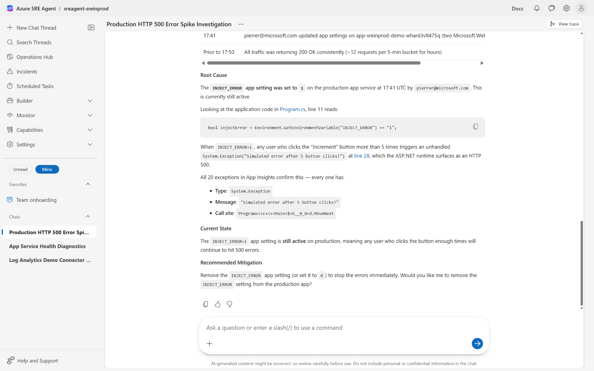

The report has six sections in this order:

| Section | What the agent writes (verbatim shape) | Source(s) |
| --- | --- | --- |
| **Timeline** | A ~2-line list: *"17:41 - `pierrer@microsoft.com` updated app settings on `app-sreinprod-demo-<suffix>` (two `Microsoft.Web/sites/config/write` operations). Prior to 17:50 traffic was 200 OK."* | `Monitor Activitylog List` + `Monitor Resource Log Query`. |
| **Root Cause** | *"`INJECT_ERROR` set to 1 at 17:41 by `pierrer@microsoft.com`."* | `Setting resource configuration` (read), correlated with the timeline. |
| **Code quote** | A fenced `csharp` block citing **`Program.cs:11`**: ``bool injectError = Environment.GetEnvironmentVariable("INJECT_ERROR") == "1";``, with a markdown link to the GitHub source `…/Program.cs#L11`. | `Read Program.cs` (Module 3 Code connector). |
| **Exception evidence** | *"`System.Exception` at `Program+<>c+<<<Main>$>b__0_0>d.MoveNext`. Example message: `Simulated error after 5 button clicks!`. 44 occurrences in the last 10 minutes."* | `QueryAppInsightsByAppId` against `appi-sreinprod-demo-<suffix>`. |
| **Current State** | *"The fault is still active. `INJECT_ERROR=1` on the production slot. Staging slot is also `INJECT_ERROR=1` (deployed by the workshop scripts; investigate before swap)."* | `Setting resource configuration` for both slots. |
| **Recommended Mitigation** | *"Would you like me to remove the `INJECT_ERROR` setting from the production app?"* | The `EXECUTION_PLAN`'s "do not execute it" clause + the **`Review`** autonomy radio. |

> 🔒 **The Module 5 contract, kept.** The agent **stopped at a question**, not at an action. It found a clearly mutating fix (`UpdateAppSettings` or `RunAzCliWriteCommands`), it knows which slot to target, it has the new value (`0`), and it still **waits for "yes"**. This is what `Review` autonomy buys you: a one-prompt diagnosis with a one-click rollback that you - not the agent - decide to release.

> ℹ️ **The agent flags a second risk.** Its `Current State` notes that `staging` *also* has `INJECT_ERROR=1`. That is a side effect of the workshop scripts (Module 4's slot setup), but the agent treats it as a real finding - it would block a "swap slots back" remediation, since the swap target is also broken. **Workshop facilitators: praise this. It is exactly the cross-slot reasoning a junior SRE would miss.**

### Step 8: Inspect the trace

Click **`View trace`** at the top right of the chat. A modal opens showing a 2-pane trace explorer:

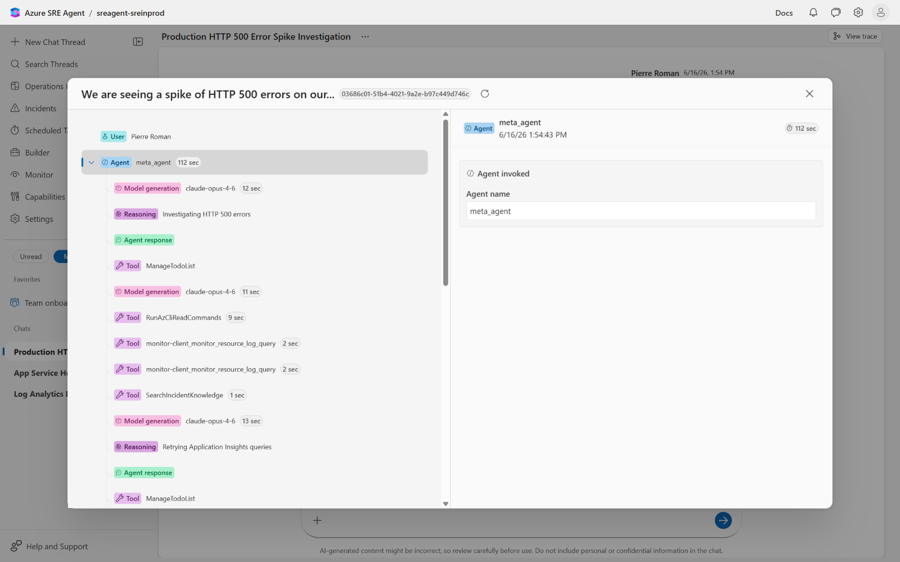

The left pane is a tree rooted at **`Agent meta_agent 112 sec`** with these child span types:

| Span type | Pill colour | What it represents |
| --- | --- | --- |
| **Model generation** | pink | An LLM round-trip. The pill shows the model id (`claude-opus-4-6` in this build) and the duration. Multiple generations per reply means the agent looped: gather, plan next tool, gather, plan next tool. |
| **Reasoning** | pink | A chain-of-thought / planning step that produced no user-visible output (e.g. *"Investigating HTTP 500 errors"*, *"Retrying Application Insights queries"*). |
| **Agent response** | green | The user-visible text that landed in chat. |
| **Tool** | purple | A single tool invocation. The span name is the **internal** tool id (e.g. `monitor-client_monitor_resource_log_query`, `RunAzCliReadCommands`, `SearchIncidentKnowledge`, `ManageTodoList`). The duration is the round-trip to the tool backend. |

For the workshop run the visible chain (top-down) was:

1. `Model generation` `claude-opus-4-6` 12 sec.
2. `Reasoning` *"Investigating HTTP 500 errors"*.
3. `Agent response` *"I'll investigate ..."*.
4. `Tool` `ManageTodoList` *(planning checklist)*.
5. `Model generation` `claude-opus-4-6` 11 sec.
6. `Tool` `RunAzCliReadCommands` 9 sec *(the `az resource list` from Step 6)*.
7. `Tool` `monitor-client_monitor_resource_log_query` 2 sec ×2 *(the dual KQL fan-out)*.
8. `Tool` `SearchIncidentKnowledge` 1 sec *(checks the agent's knowledge files for similar past incidents)*.
9. `Model generation` `claude-opus-4-6` 13 sec.
10. `Reasoning` *"Retrying Application Insights queries"* *(the self-correction)*.
11. `Agent response` *(the second narrative chunk)*.
12. `Tool` `ManageTodoList` *(progress update on the checklist)*.
13. ... continues for a total of `112 sec` wall time.

Click any tree node to load its **input** + **output** in the right pane. For tool nodes that means the literal JSON request and response - this is where you would copy the failing KQL, the Activity Log filter, or the `az` invocation if you needed to reproduce a step manually.

> 💡 **What the trace gives you that chat does not.** Chat shows you the agent's *narration*. The trace shows you the **plan-then-act loop**: every model decision, every tool input, every tool output. **For post-incident reviews this is the artifact you save**, not the chat transcript. It tells you whether a wrong answer was a model hallucination (bad model generation) or bad evidence (bad tool input), and lets you pin a regression to a specific tool version.

> 🔬 **The model on the pink pill changes.** Today the agent runs **`claude-opus-4-6`** for both planning and final synthesis. Earlier builds used `gpt-4o`; future builds may route different span types to different models. **Capture the trace for any incident you intend to learn from, because the model id on the pill is part of the answer.**

### Step 9: Decide on remediation

Back in the chat thread, the agent's last message is the question:

> *"Would you like me to remove the `INJECT_ERROR` setting from the production app?"*

You have three choices. Pick **one and only one** for the workshop, and tell participants out loud which path you took so they can map it to Module 5's autonomy radio:

| Reply | What the agent does | When to use this |
| --- | --- | --- |
| **`yes`** (or `approve`, `go ahead`) | Calls `UpdateAppSettings` (or `RunAzCliWriteCommands`) on the production slot, sets `INJECT_ERROR=0`, waits for the App Service worker to reflect the new value, drives a single recovery probe, posts a confirmation. **Total wall time ~30s.** | When the workshop schedule allows for a recovery validation step in this module. |
| **`no, leave the broken state in place`** | Acknowledges, leaves both slots untouched. The Sev3 incident on the Incidents page stays `Acknowledged / Completed` (the **autonomous diagnosis** is done; only the **interactive remediation** was declined). | When you want to re-run the drill in the next workshop session without resetting the environment. **This is the recommended workshop default** - it lets the next cohort see the broken state already in place. |
| **`first, swap slots back`** | The agent **refuses** (or warns) because it observed in Step 7 that staging is *also* broken. It will counter-propose `INJECT_ERROR=0` on production directly. | When you want to demonstrate cross-slot reasoning live in front of participants. |

> ⚠️ **Approval is logged but not auto-traced.** The text you type to approve is captured as a user message in the chat thread, but the **trace** for the agent's *next* reply does not retroactively annotate the previous reply with "approved at HH:MM". For a real incident review, snapshot the chat thread (browser print-to-PDF or screenshot) **alongside** the trace. The trace alone will not tell auditors who said "go".

### Step 10 *(optional)*: Validate recovery

Only run this step if you replied **`yes`** in Step 9. From the workshop root:

```powershell
pwsh ./scripts/smoke-test.ps1
```

The script issues `Invoke-WebRequest` against both `https://<APP_URL>` and `https://<STAGING_URL>` and asserts `200`. Expected output:

```text
Probing production: https://app-sreinprod-demo-<suffix>.azurewebsites.net ... 200
Probing staging:    https://app-sreinprod-demo-<suffix>-staging.azurewebsites.net ... 200
✅ Smoke test passed.
```

If production returns `200` and the agent's **Incidents** row has *not* moved off `Acknowledged / Completed`, that is correct: the row reflects the **alert** state, not the **resource health** state. Azure Monitor will resolve the metric alert on its own once the rolling 5-minute window clears.

### Step 11 *(optional)*: Look at the Operations Hub volume chart

Re-open **Operations Hub** in the left rail. The **`Daily Volume by Source`** chart now has a fresh bar on today's date with two segments:

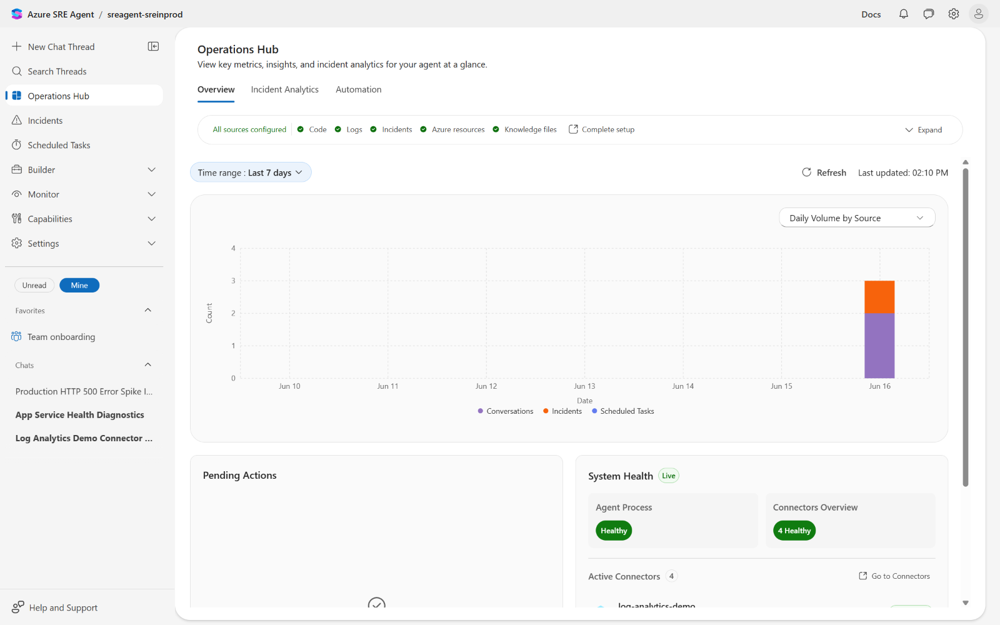

| Legend chip | What the segment counts | Source |
| --- | --- | --- |
| **Conversations** *(purple)* | Chat threads that received at least one user message during the day. The thread you created in Step 5 contributes `+1`. | Chat surface. |
| **Incidents** *(orange)* | Incidents the agent handled (autonomous + interactive). The `failure anomalies` Sev3 from Step 4 contributes `+1`. | Response plan + Incident Platform. |
| **Scheduled Tasks** *(blue, not shown today)* | Tasks scheduled via `Builder` → `Scheduled Tasks`. Empty for this workshop. | Scheduler. |

> ℹ️ **Why the chart is the easiest hand-off slide.** When an executive asks *"what did the agent do today?"*, this single chart answers it without exposing chat content or PII. The drill-down to the underlying threads / incidents requires the same Azure RBAC the operator already had, so the chart is **safe** to embed in non-operator dashboards.

### Step 12 *(optional)*: Reset for the next run

If you replied **`no`** in Step 9, the environment is already in the right shape for the next workshop cohort - **stop here**.

If you replied **`yes`** and want to put the broken state back for someone else, run:

```powershell
pwsh ./scripts/demo-rollback.ps1
```

The script re-asserts `INJECT_ERROR=0` on production (idempotent), `INJECT_ERROR=1` on staging (matching the post-deploy baseline), and runs a single smoke test. **It does not delete the chat thread or the Incidents row** - those are useful as historical context for the next cohort. Delete them by hand if you want the agent to look "fresh".

## Validation checklist

- [ ] **Pre-burst baseline** captured: `Operations Hub` shows `Agent Process: Healthy`, `Connectors Overview: 4 Healthy`, **flat** `Daily Volume by Source` for today; `Incidents` page reads `0 / 0` across all counters.
- [ ] **Fault confirmed in metrics** with `az monitor metrics list ... Http5xx ... Total >= 5` on the production slot for at least one PT1M bucket inside the burst window.
- [ ] **Both alerts fired**: `alert-sreinprod-demo-http5xx` (Sev2, visible in Azure Monitor → Alerts) and `Failure Anomalies - appi-sreinprod-demo-<suffix>` (Sev3, visible in the agent's `Incidents` page).
- [ ] **Sev3 row** in the agent's Incidents page reads `Acknowledged / Completed` with `Response plan = quickstart_response_plan` (proves Module 5 wired correctly and `Review` autonomy did not block read-only diagnosis).
- [ ] **Sev2 row** is **absent** from the agent's Incidents page (proves the response plan filter is structural, per Module 5).
- [ ] **Chat investigation** thread exists with title **`Production HTTP 500 Error Spike Investigation`** and a final report containing **Timeline**, **Root Cause**, a **fenced code quote** of `Program.cs:11`, the verbatim exception **`Simulated error after 5 button clicks!`**, and a **Recommended Mitigation** ending in *"Would you like me to ...?"*.
- [ ] **Trace** for the final reply lists at least one `Model generation` span with model id **`claude-opus-4-6`**, at least two `Tool` spans (`monitor-client_monitor_resource_log_query`, `RunAzCliReadCommands`), and a `ManageTodoList` span.
- [ ] **Approval gate held**: no `UpdateAppSettings` / `RunAzCliWriteCommands` span fired before the operator typed an approval. (Verify by Ctrl+F in the trace JSON if needed.)
- [ ] **Operations Hub** `Daily Volume by Source` shows a non-zero bar for today with **Conversations** + **Incidents** segments.

## Discussion prompts

- The Sev2 metric alert paged a human; the Sev3 smart detector triggered the agent. **In your production org, who owns the severity catalog, and what is the change-control process for promoting an alert into the agent's plan filter?** *(Hints: alert authors are not always platform owners, severity drift, the asymmetry between "agent over-acts on Sev2" and "agent under-acts on Sev3".)*
- The agent ran an end-to-end read-only investigation in **~112s** for **~$X** of model tokens (visible in `Operations Hub` → `Agent Consumption` after the fact). **At what alert volume does the autonomous path become more expensive than a paged human, and how do you keep the cooldown (Module 5 Step 9) in the right place?** *(Hints: alert storms, dedupe, the `Alert reinvestigation cooldown` lever, the cost of a human SRE-on-call rotation.)*
- The trace shows **`SearchIncidentKnowledge`** firing as part of the chain. **Module 5 left the "Choose past incidents" picker empty.** What does the agent search against, and what would change if you uploaded a curated knowledge file of last quarter's Sev3s? *(Hints: knowledge file connectors from Module 4, RAG vs in-context, retrieval cost, knowledge poisoning.)*
- The agent flagged that **staging is also broken** as part of `Current State`. The **slot-swap rollback** an unaware human might attempt would have made things worse. **How would you encode that cross-slot reasoning into the `EXECUTION_PLAN` so it survives a future plan regeneration?** *(Hints: explicit pre-conditions, "verify all slots are healthy before proposing swap", the `Generate + review` button erasing your edits.)*
- The investigation took **~2 minutes**. **What would the same investigation look like with the response plan saved as `Autonomous (Default)` (Module 5 Step 9) instead of `Review`?** *(Hints: the `Recommended Mitigation` prompt would not fire, `UpdateAppSettings` would land directly, the `Acknowledged / Completed` row in Incidents would already reflect a remediated app, who finds out the fault was real vs a test.)*

## Reference: full screenshot index

Captured against the live agent at `https://sre.azure.com/agents/.../sreagent-sreinprod` in June 2026. Files live under `images/wizard/` so facilitators can reuse them in slides.

| # | Screen | File |
| --- | --- | --- |
| 56 | Agent chat home, *All sources configured* pill, empty thread *(pre-incident baseline)* ⭐ embedded | [56-agent-home-pre-incident.png](../images/wizard/56-agent-home-pre-incident.png) |
| 57 | Incidents page, all counters at 0, *No incidents found* ⭐ embedded | [57-incidents-page-empty.png](../images/wizard/57-incidents-page-empty.png) |
| 58 | Operations Hub, Agent Process Healthy, Connectors Overview 4 Healthy, flat volume ⭐ embedded | [58-operations-hub-pre-incident.png](../images/wizard/58-operations-hub-pre-incident.png) |
| 59 | New Chat Thread, blank input ⭐ embedded | [59-new-chat-blank.png](../images/wizard/59-new-chat-blank.png) |
| 60 | Investigation prompt typed into the input, Send button active ⭐ embedded | [60-investigation-prompt-typed.png](../images/wizard/60-investigation-prompt-typed.png) |
| 61 | Chat thread created, *Investigating HTTP 500 errors* chip, first reply visible ⭐ embedded | [61-investigation-running.png](../images/wizard/61-investigation-running.png) |
| 62 | Tool cards: 2× *Monitor Resource Log Query* Completed, *Executing resource list* Safe, *Retrying Application Insights queries* ⭐ embedded | [62-investigation-tools-running.png](../images/wizard/62-investigation-tools-running.png) |
| 63 | More tool cards: *Monitor Activitylog List*, *Read Program.cs*, *Read demo-inject-errors.ps1*, *Setting resource configuration* Medium risk ⭐ embedded | [63-investigation-progress2.png](../images/wizard/63-investigation-progress2.png) |
| 64 | Final report: Timeline, Root Cause with `INJECT_ERROR=1`, Program.cs:11 code quote, exception detail, Recommended Mitigation prompt ⭐ embedded | [64-investigation-progress3.png](../images/wizard/64-investigation-progress3.png) |
| 65 | Incidents page after the burst: Sev3 row, Acknowledged + Completed, `quickstart_response_plan` attached ⭐ embedded | [65-incidents-with-alert.png](../images/wizard/65-incidents-with-alert.png) |
| 66 | Investigation summary, top of thread (above-the-fold view of prompt + early tool cards) | [66-investigation-summary-top.png](../images/wizard/66-investigation-summary-top.png) |
| 67 | View trace modal expanded: claude-opus-4-6 model spans, Reasoning spans, Tool spans for ManageTodoList / RunAzCliReadCommands / monitor-client_monitor_resource_log_query / SearchIncidentKnowledge ⭐ embedded | [67-trace-view.png](../images/wizard/67-trace-view.png) |
| 68 | Operations Hub post-incident: Daily Volume bar with Conversations + Incidents segments on today ⭐ embedded | [68-ops-hub-post-incident.png](../images/wizard/68-ops-hub-post-incident.png) |

## Further reading

- [Incident response plans in Azure SRE Agent](https://go.microsoft.com/fwlink/?linkid=2341945): plan structure, supported severities, and platform connectors. Module 5 set this up; Module 6 exercised it.
- [Smart detection in Application Insights](https://learn.microsoft.com/azure/azure-monitor/alerts/proactive-failure-diagnostics): the source of the Sev3 `Failure Anomalies` alert that triggered the autonomous path.
- [Module 4: Connect Observability](./4-Connect-Observability.md) wired the two telemetry connectors (`log-analytics-demo`, `app-insights-demo`) the agent's tool fan-out reads from.
- [Module 5: Response Plans and Guardrails](./5-Response-Plans-and-Guardrails.md) defines the `quickstart_response_plan` you just watched fire.
- [Module 7: Production Rollout](./7-Production-Rollout.md) takes the same workflow into a real, less-canned environment.

## Notes for repo owners

Re-capture screenshots `56` to `68` if any of the following ships:

- The **Operations Hub** layout changes - in particular if the **All sources configured** pill row, the **System Health** card layout, or the **Daily Volume by Source** chart legend reorders or renames its segments.
- The **Incidents** page columns are renumbered or renamed (today: `Alert title`, `Severity`, `Alert status`, `Agent status`, `Alert created`, `Total alerts`, `Last fired`, `Response plan`).
- The agent's chat surface changes how tool calls are rendered - in particular the **risk badges** (`Safe`, `Medium risk`) or the **inline command preview** below the card title.
- The trace explorer changes its span taxonomy (today: `Model generation`, `Reasoning`, `Agent response`, `Tool`) or the model id pill stops showing the model name.
- The default model behind agent generations changes off **`claude-opus-4-6`** - the Step 8 callout name-checks the model and the trace explanation hinges on the pill being present and human-readable.
- The sample app (`Azure-Samples/app-service-dotnet-agent-tutorial`) renames `INJECT_ERROR`, moves the throw off `Program.cs:11`, or changes the exception message off *"Simulated error after 5 button clicks!"* - the Step 7 verbatim section quotes all three.
- `scripts/demo-warmup.ps1` is rewritten to use a different fault path (e.g. dependency injection rather than env var). The Step 2 timing callout assumes the env-var-restart path.

The brittlest screenshots in the set are **64** (the final report wording is model-dependent and will drift between builds), **67** (the trace span chain is plan-dependent and varies per run), and **68** (the chart aggregates everything in the agent today, so any other workshop activity on the same day will pollute it - re-capture on a clean day).
